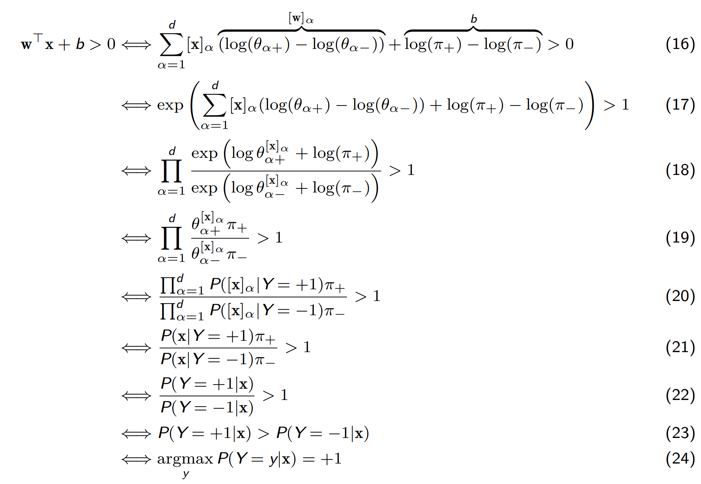
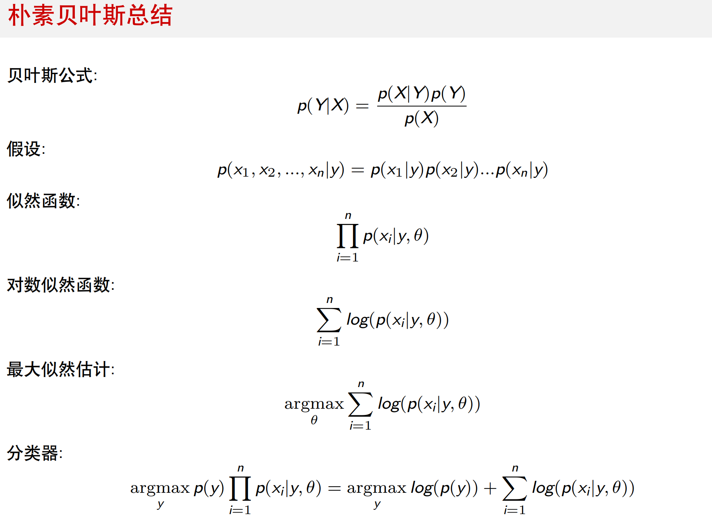

# 机器学习

监督学习: 我们知道正确的答案或期望的输出. 有分类和回归两种.
无监督学习: 我们不展示输出，或者达到特定输出所需的特定输入。例如: 聚类, 降维, 关联分析.
半监督学习: 同时使用有标签和无标签的数据进行训练.
自监督学习: 自动生成标签, 然后用生成的标签进行训练.

泛化 (Generalization): 模型适用于新样本的能力即泛化能力。一般而言训练样本越多越有可能通过学习获得强泛化能力的模型

假设空间 (Hypothesis)：对于当前任务，学习算法所考虑的所有可能的假设构成的空间称为假设空间，即模型可以表示的所有可能的解。

奥卡姆剃刀: 若非必要，勿增实体. 假设空间中可能有多个与训练集一致的假设，但他们对测试数据会预测出不同的结果. 学习过程中对某种类型假设的偏好称作归纳偏好. 若有多个假设与观察一致，选最简单的那个.

没有免费的午餐: 没有一种算法能在所有问题上都表现最好

概率近似正确: 学习算法能够以**高概率**在一个**接近正确**的程度上输出正确的假设.

参数模型: 强假设. 通常假设总体服从某个分布，该分布由一些参数确定。在此基础上构建的模型，有固定数量的参数。
非参数模型: 更灵活. 对于总体分布不做任何假设，只知道分布是存在的。非参数模型并不是没有参数，而是模型的参数量随着训练数据的增加而增长。

# 损失函数

## 二分类损失

### Hinge Loss

$$
\max(1 - h(x)y, 0)^p
$$

$p = 1$ 时是标准无约束 SVM; $p = 2$ 时是均方 SVM (可微).

### Log Loss

$$
\log(1 + e^{-h(x)y})
$$

逻辑回归使用这种损失函数, 由概率推出.

### Exponential Loss

$$
e^{-h(x)y}
$$

激进, 容易受噪声影响.

### 0-1 损失

$$
[\hat y_i \neq y_i]
$$

不连续和非凸的, 难以优化.

## 回归损失

### 均方损失

最小二乘.

$$
(h(x) - y)^2
$$

损失非负, 平方增长.

预测会是训练数据的概率均值.

### 绝对值损失

$$
|h(x) - y|
$$

适合有噪声的数据, 这样错误数据不会像在均方损失里那样主导损失.

如果 $y$ 关于 $x$ 的概率分布是 $P(y|x)$, 则期望绝对值损失最小的预测就应当是概率中值 (中位数).

### Huber Loss

平滑绝对值损失, 一阶可微.

$$
\frac 12 (h(x) - y)^2 (|h(x) - y| < \delta)\\
\delta(|h(x) - y| - \frac \delta 2) \delta (|h(x) - y| \geq \delta)
$$

绝对值损失和均方损失的组合.

### Log-Cosh Loss

$$
\log \text{cosh}(h(x) - y)\\
\text{cosh}(x) = \frac{e^x - e^{-x}}{2}
$$

有渐近线, 在偏差大的时候呈现线性的趋势, 在零点附近平滑. 处处无限次可微.

# 正则项

过拟合: 小数据量 + 复杂模型

模型的复杂度: 参数量, 参数大小.

正则项是用来通过降低模型复杂度来缓解过拟合的.

参数过大会导致更大的惩罚, 当参数变成 $0$ 的时候, 我们也可以认为删去了一个参数.

## 范数

$l_p$ 范数定义为:

$$
||w||_p = (\sum w_i^p)^{\frac 1p}
$$

即 $w$ 到原点的 Minkowski 距离.

## 弹性网络

$$
\alpha ||w||_1 + (1 - \alpha) ||w||_2^2
$$

是 $l_1$ 和 $l_2^2$ 的组合. 严格凸, 不可微.

## 稀疏解和稠密解

稀疏解: 存在更少的非零参数.

当 $p > 1$ 的时候, 小的分量惩罚非常小, 所以是鼓励小分量不等于 $0$ 的, 但是当 $p \leq 1$ 的时候, 小分量在接近 $0$ 的时候梯度更大, 鼓励小分量被 $0$ 处的黑洞吸入.

但是 $p \leq 1$ 的情况是非凸的 (凸的好处: 局部最优就是全局最优, 梯度下降/牛顿迭代收敛稳定高效), 所以弹性网络通过叠加 $l_2^2$ 引入凸性.

## $\lambda$

选择 $\lambda$ 的大小, 可以通过验证集上的表现来调参.

Telescopic 搜索. 先找 $\lambda$ 的数量级, 再找附近更优的值. (减少枚举)

## 早停

调整迭代次数, 防止过拟合.

# 监督学习

## 混淆矩阵

||$\hat y = 1$| $\hat y = 0$ |
|-|-|-|
|$y = 1$|TP|FN| 
|$y = 0$|FP|TN| 

查准率: $\frac {TP}{TP + FP}$
查全率: $\frac {TP}{TP + FN}$

## 训练, 验证, 测试

有时候用测试集验证. (反正也不会从验证集学习)

按时间先后划分训练集和测试集可以让模型学习过去的模式来解决未来的问题. 否则最好均匀随机分割, 保证两个数据集的分布相同.

留出法: 训练集和测试集互斥
交叉验证法: 分成 $k$ 个互斥子集, 每次用一个子集做测试集, 剩下的 $k - 1$ 个做训练集.
自助法: 有放回随机抽样.

## 生成-判别

可以认为监督学习是在估计 $P(X, Y)$, 当认为 $P(X, Y) = P(X|Y)P(Y)$ 时, 称为生成学习, 否则直接估计 $P(X, Y)$ 即为判别学习.

# k-NN

假设: 相似的输入有相似的输出.

对于一个 $x_*$ 在 $k$ 个最相似的 $x$ 中选择 (出现最多的标签/标签的平均值).

也可以按距离给 $k$ 个邻居加权.

$k$ 大了欠拟合, 小了过拟合.

## Minkowski 距离

$$
\left (\sum_{r = 1}^d |x_r - z_r|^p \right )^{\frac 1p}
$$

$p = 1$ 时, 即为曼哈顿距离, $p = 2$ 时即为欧氏距离, $p \to \infin$ 时即为切比雪夫距离.

## Hamming 距离

$$
\frac 1n \sum_{i} [x_i \neq y_i]
$$

即二进制串异或后 $1$ 的数量 (的均值).

## 余弦相似度

余弦越大, 指向越相同; 余弦趋于 $0$, 指向垂直; 余弦越小, 指向越相反.

$$
cos \left <A, B\right > = \frac {A * B}{|A||B|}
$$

## 贝叶斯最优分类器

假设知道了所有 $x$, $y$ 的分布 $P(y|x)$. 那么预测 $\hat y$ 就是 $\argmax_y P(y|x^*)$.

那么错误率就是当 $\hat y \neq y^x$ 的概率, 也就是 $1 - P(\hat y|x^*)$.

### 1-NN

当样本数 $n \to \infin$, 类别数 $m = 2$ 时, 1-NN 错误率不大于贝叶斯最优分类器的两倍.

由于 $n \to \infin$, $x^*$ 和 $x$ 同分布, 所以存在足够多的 $(x_i, y_i)$ 满足 $x_i = x^*$. 而且成为最近邻的机会, 即输出的分布有 $P(\hat y | x^*) = P(y^* | x^*)$.

1nn的错误率为: $P(y_0 | x^*)(1 - P(\hat y_0 | x^*)) + (1 - P(\hat y_1 | x^*))P(\hat y_1 | x^*)$, 也就是 $2P(y_0 | x^*)(1 - P(y_0 | x^*)) \leq 2P(y^* | x^*)$.

课件没说是二分类, 耽误了我好久.

## 维度灾难

维度特别大时, 对于随机分布于边长为 $1$ 的超立方体中的数据点, 包含一个点和它最近的 $k$ 个邻居的最小超立方体会越来越趋近于全体数据分布的大超立方体; 随机分布的点对之间的距离越来越趋近于一个由维度数决定的常数.

高维数据一般会先降维处理.

## 约简

类似于剪枝, 将数据中的*类离群点*删除, 剩余的数据分为原型和吸收点, 保留原型, 删除吸收点, 可以减小模型规模.

类离群点的寻找可以给出一个阈值 $r < k$, 如果一个点的 $k$ 近邻中有大于等于 $r$ 个和它不在同一个类别, 则删除之.

# 感知机

假设: 二分类, 线性可分.

求一个超平面: $w^Tx + b = 0$, 将空间中的点分成两类.

为了处理偏置项, 增加一维, 令 $x$ 在这个维度上固定为 $1$, 则这个维度上的 $w$ 值就相当于 $b$, 即对增加维度后的 $x$ 只需要学习 $w$, 得到过原点的超平面 $wx = 0$ 即可.

记两类的 $y$ 分别为 ${+1, -1}$, 那么我们认为 $w^Tx > 0$ 的点的标签应当是 $1$, $w^Tx < 0$ 的点的标签应当是 $-1$.

## 迭代法

$w$ 加上一个向量相当于将平面的法向量沿增量的方向拖拽. 对于 $y = 1$, 但是 $w^Tx < 0$ 的样本, 我们希望拖拽 $w$ 所以需要 $x$; 反之对于 $y = -1$, 但是 $w^Tx > 0$ 的样本, 我们希望推开 $w$, 所以减去 $x$. 对于其他正确分类的情况, 便不需要进行更多调整.

更一般的, 只要 $yw^Tx \leq 0$, 就用 $w + yx$ 更新 $w$.

规定一个迭代次数上界, 每次遍历所有样本点, 如果所有样本点都被正确分类或到达最大迭代次数停止.

## 收敛

对于线性可分的数据, 感知机可在有限次迭代后找到一个可分离两个类的超平面.

假设存在一个解 $w^*$. 不失一般性, 将所有数据点缩放到单位超球内, 然后将 $w^*$ 标准化. 定义 Margin $\gamma = \min_{(x_i, y_i)\in D} |x_i^T w^*|$. 也就是距离超平面最近的点的距离.

这时断言: 感知机最多出现 $\frac 1{\gamma^2}$ 次错误.

证明: 对于 $w$ 到 $w + yx$ 的一次更新, 有 $y(w^Tx) \leq 0$, 不然不更新, 还有 $y({w^*}^Tx) > 0$, 因为 $w^*$ 是一个解.

$$
{(w+yx)}^Tw^* - w^Tw^* = yx^T w^* > 0
$$

又因为 $\gamma$ 的定义, 有 $|{(w+yx)}^Tw^* - w^Tw^*| \geq \gamma$. 即每次更新 $w^Tw^*$ 至少增加 $\gamma$.

$$
{(w+yx)}^T(w+yx) - w^Tw = 2yw^Tx + y^2x^Tx = 2yw^Tx + |x|^2 \leq |x|^2 \leq 1
$$

所以每次更新 ${(w+yx)}^T(w+yx)$ 最多增加 $1$. 假设做了 $M$ 次更新, $M\gamma \leq w^Tw^* \leq |w| = \sqrt{w^Tw} \leq \sqrt M$, 因此 $\gamma \leq \frac 1{\sqrt M}$, 得到: $M \leq \frac 1{\gamma^2}$ 

如果不缩放, 记 $\alpha = \max |x|$, 则有 $M \leq {(\frac 1{\alpha})}^2$.

## 思考

其实感知机的训练过程可以认为是梯度下降的过程. 考虑损失函数为: 如果正确分类就是 $0$, 否则损失就是点到超平面的距离 $|w^Tx|$, 关于 $w$ 的梯度就是 $x$. 所以减去梯度 $x$.

# 支持向量机 (SVM)

线性二分类器. 感知机的扩展, 可以找到距离最近的点最远的超平面.

点 $x$ 到超平面的距离是 $\alpha |w|$, 其中 $\alpha = \frac {w^Tx + b}{w^Tw}$. 所以有 $|d| = \frac {|w^Tx + b|}{|w|}$. 这个值是不随 $w, b$ 等比例放缩而改变的. (显然, $w, b$ 等比例放缩不会改变超平面, 也自然不会改变点到超平面的距离) 令 $\gamma(w,b) = \min_{x} d$.

我们需要求一组 $w$, 使得 $\gamma(w,b)$ 最大, 即为:

$$
\argmax_{w,b} \min_{x} \frac {|w^Tx + b|}{|w|}\\
= \argmax_{w,b} \frac 1{|w|} \min_{x} |w^Tx + b|\\
y(w^Tx + b) \geq 0
$$

不失一般性, 等比例缩放 $w, b$, 使得, $\min|w^Tx + b| = 1$. 则原式变成: $\argmax_{w,b} \frac 1{|w|} = \argmin_{w,b} w^Tw$. 也就是令 $w$ 的模长尽可能小. 把正确性的约束和最小间隔的约束合并, 得到新的约束:

$$
\argmin_{w,b} w^Tw\\
y(w^Tx + b) \geq 1
$$

目标是二次的, 约束条件都是线性的. 可以用 QCQP (Quadratic Constrained Quadratic Program) 求解器来有效地求解. 对于满足 $y(w^Tx + b) \geq 1$ 的 $x$, 称之为 "支持向量", 支持向量移动或改变会导致 SVM 改变.

## 软间隔 SVM

允许错误分类的出现, 给错误样本惩罚, 对于正确的样本保持之前的约束.

$$
\argmin_{w,b} w^Tw + C\sum \xi_i\\
y(w^Tx + b) \geq 1 - \xi_i (\xi_i \geq 0)
$$

这个惩罚是线性的, 更符合我们对错误的容忍程度.

因为有了 $\xi$, 第二行的约束就没必要存在了:

$$
\argmin_{w,b} w^Tw + C\sum \max(0, 1 - y(w^Tx + b))\\
$$

可以梯度下降.

## 核化

带约束软间隔 SVM:

$$
\argmin_{w,b} w^Tw + C\sum \xi\\
y(w^Tx + b) \geq 1 - \xi
\xi \geq 0\\
$$

加入拉格朗日乘子 $\alpha$, KKT 条件共有四种:

### 可行性

$$
1 - \xi - y(w^Tx + b) \leq 0\\
-\xi \leq 0
$$

### 梯度条件(最优性)

$$
\nabla (w^Tw + C\sum \xi) + \sum \alpha_i \nabla(1 - \xi_i - y_i(w^Tx_i + b)) - \sum \mu_i \nabla \xi_i = 0\\
$$

对 $w$, $b$, $\xi$ 分别求偏导, 让他们都为 $0$.

$$
w = \sum \alpha_i y_ix_i\\
0 = \sum \alpha_i y_i
C = \alpha_i + \mu_i
$$

### 互补松弛

$$
\alpha_i(1 - \xi_i - y_i(w^Tx_i + b)) = 0\\
\mu_i \xi_i = 0
$$

### 乘子非负

$$
\alpha_i \geq 0\\
\mu_i \geq 0
$$

结合前面的 $C = \alpha_i + \mu_i$, 得到 $0 \leq \alpha_i \leq C$. 三条约束变成这一条.

### 对偶问题

综合梯度条件, 互补松弛, 乘子非负三种约束, 我们可以省略掉可行性条件. 这是因为, $\xi$ 本身也不是有规定值的变量, 我们已经将它对损失值的贡献编码到了梯度里, 也就是通过梯度条件 $C = \alpha_i + \mu_i$ 令**它决定的损失值**尽可能小.

对于 $\xi$ 的值具体的取值, 其实不重要. After all, $\xi$ 的存在是为了过滤掉小于 $0$ 的 $1 - y_i(w^Tx_i + b)$ 提供的反向损失值. 这部分在拉格朗日函数中的体现是: 当 $y_i(w^Tx_i + b) \geq 1$ 的时候, $\alpha_i$ 因为互补松弛为 $0$ 了, 也就实现了**不惩罚**. 剩下的情况, $y_i(w^Tx_i + b) < 1$, $\alpha$ 不一定是 $0$, 所以就存在一定的损失值.

对于 $\mu$, 它的存在令 $\xi_i$ 在拉格朗日函数中的总系数等于 $C - \alpha_i - \mu_i = 0$, 使得 $\xi$ 真正变成形式变量, 不对损失函数有任何贡献, 而是完全由 $1 - y_i(w^Tx_i + b)$ 来提供损失. 这也是为什么我们最后求解的时候不需要关注 $\mu$. 学习的过程就是在 $[0, C]$ 之间插一个板, 一侧是 $\alpha$, 另一侧是 $\mu$, 其中, $\alpha$ 的一侧是含 $1 - y_i(w^Tx_i + b)$ 的, 另一侧不含 $1 - y_i(w^Tx_i + b)$.

整理对偶问题的约束式子:

$$
w = \sum \alpha_i y_ix_i\\
0 = \sum \alpha_i y_i
\alpha_i(1 - \xi_i - y_i(w^Tx_i + b)) = 0\\
\mu_i \xi_i = 0
0 \leq \alpha_i \leq C
$$

并且由于 $\xi$ 已经不产生贡献了, 所以在拉格朗日函数中将其消去, 将 $w$ 值代入到互补松弛的式子中, 最后把 $\sum \alpha_i y_i = 0$ 代入消去 $b$:

$$
\frac 12 w^Tw + \sum \alpha_i (1 - y_i(w^Tx_i + b))\\
\sum_{i, j} \alpha_i \alpha_j y_i y_j x_i^T x_j + \sum_{i} \alpha_i 1 - y_i(\sum \alpha_j y_jx_j^Tx_i + b)\\
\sum_{i, j} \alpha_i \alpha_j y_i y_j x_i^T x_j - \alpha_i \alpha_j  y_i y_jx_j^Tx_i + \sum_i \alpha_i (1 - y_i b)
-\frac 12 \sum_{i, j} \alpha_i \alpha_j y_i y_j x_i^T x_j + \sum_i \alpha_i (1 - y_i b)
-\frac 12 \sum_{i, j} \alpha_i \alpha_j y_i y_j x_i^T x_j + \sum_i \alpha_i
$$

注意, 现在我们操作的式子一直都是拉格朗日函数而不是原来意义的损失函数. 而拉格朗日函数由两种参数, 原参数 $w, b$ 和拉格朗日乘子 $\alpha, \mu$. 我们的取极值也需要在这些维度上进行分类讨论.

拉格朗日乘子法认为, 只有拉格朗日函数在拉格朗日乘子 $\alpha, \mu$ 上取极大值的时候, 原函数满足约束条件; 满足约束的基础上, 并且在原参数 $w$ 上取得极小值的时候, 这时拉格朗日函数取得原函数的极小值. 在之前的梯度条件中, 已经用 $\alpha, \mu$ 表达了 $w$ 和 $b$, 写出了令拉格朗日函数在 $w, b$ 上取极小值的表达式. 接下来, 需要对拉格朗日函数上在 $\alpha, \mu$ 上取极大值, 使其满足约束, 也就是令其相反数取极小值.

整理出对偶问题的最终形式:

$$
\argmin_{\alpha} \frac 12 \sum_{i, j} \alpha_i \alpha_j y_i y_j x_i^T x_j - \sum_i \alpha_i\\
\sum \alpha_i y_i = 0\\
0 \leq \alpha_i \leq C
$$

发现没有对 $b$ 进行求解, 因为 $b$ 被约掉了 (系数为 $0$), 但是 $b$ 在核化的问题中的意义是不变的, 所以可以求出 $\alpha$ 之后, 用支持向量重新求 $b$:

$$
y_i(\sum y_j\alpha_j x_j^T x_i + b) = 1\\
b = \frac 1{y_i} - \sum y_j\alpha_j x_j^T x_i\\
b = y_i - \sum y_j\alpha_j x_j^T x_i\\
$$

### 加权和

审视训练出的分类器:

$$
h(x) = \sum \alpha_i y_i x_i^T x + b
$$

发现答案是 $y$ 的加权和加上一个偏移. 权值则是 $\alpha x_i^T x$, 可以认为是它们的距离. 所以 SVM 核化后可以理解为加权的 kNN. ($k = n$, 如果选择核函数为 RBF 核, 则指数衰减会让绝大多数训练样本几乎没有权重)

### 训练

为了满足 $\sum \alpha_i y_i = 0$ 的约束, 不能每次只更新一个 $\alpha$, 也不能直接梯度下降, SMO 算法每次更新两个 $\alpha$, 这样就可以保持约束的前提下对 $\alpha$ 进行调整.

# 概率估计

## MLE (最大似然估计)

目标: 似然函数最大.

先对数据的分布做假设, 考虑在假设中, 训练数据 $D$ 出现的概率. 我们希望找到让 $D$ 出现的概率最大的分布参数 $\theta$. 如果所有样本都是独立同分布的, 那么整个训练数据出现的概率应该是它们的乘积.

令概率的乘积最大也就是令概率的对数的总和最大. 我们对这个似然函数进行求导, 然后令其等于 $0$ 即可找到 $\theta$.

## MAP (最大后验估计)

### Beta 分布

$$
P(\theta) = \frac{\theta^{\alpha - 1}(1 - \theta)^{\beta - 1}}{B(\alpha, \beta)}
$$

其中 $B(\alpha, \beta)$ 是 Beta 函数, 确保了 $P$ 的积分为 $1$:

$$
B(\alpha, \beta) = \frac{\Gamma (\alpha) \Gamma (\beta)}{\Gamma (\alpha + \beta)}
$$

$\Gamma (z)$ 是 Gamma 函数, 可以感性理解为是 $(z - 1)!$ 的插值.

### MAP

我们对于 $\theta$ 的先验认识是 Beta 分布. MAP 需要做的是基于训练数据 $D$, 选择一个最有可能的 $\hat \theta$ 作为后验估计.

由于 $P(\theta | D) = \frac{P(D|\theta)P(\theta)}{P(D)}$, $D$ 已经出现了, 可以认为是 $1$, 所以令 $P(\theta | D)$ 最大, 就是令 $\log P(\theta | D)$ 最大, 就是令 $\log P(D|\theta) + \log P(\theta)$ 最大:

$$
\arg \max_{\theta} \log P(D|\theta) + \log P(\theta)\\
= \arg \max_{\theta} \sum_{x \in D} \log P(X|\theta) + (\alpha - 1) \log \theta + (\beta - 1) \log (1 - \theta)
$$

当样本足够多, $\hat \theta_{MAP} \to \hat \theta_{MLE}$. 如果样本较少, 那么 MAP 的可靠性更大程度上取决于先验.

本质上 MAP 是添加了正则项的 MLE.

## 二项分布的特化

$$
\arg \max_{\theta} \sum_{x \in D} \log P(X|\theta)\\
= \arg \max_{\theta} n_1 \log \theta + n_0 \log \theta\\
\arg \max_{\theta} \log P(D|\theta) + \log P(\theta)\\
= \arg \max_{\theta} (n_1 + \alpha - 1) \log \theta + (n_0 + \beta - 1) \log \theta\\
$$

在 MLE 中, $\theta$ 的闭式解是 $\frac {n_1}{n}$, 在 MAP 中是 $\frac {n_1 + \alpha - 1}{n + \beta + \alpha - 2}$.

# 朴素贝叶斯

假设: feature 互相独立.

则 $P(x|y) = \prod P(x_i|y)$.

朴素贝叶斯分类器是一个线性分类器, 感性理解就是由于它假设特征独立, 所以它是没法解决异或问题的.

最大化 $D$ 中每对 $(x, y)$ 出现的概率的乘积, 也就是最大化概率对数的总和.

$$
\arg \max_y P(y|x)\\
= \arg \max_y P(x|y)P(y)\\
= \arg \max_y \sum \log P(x_i|y) + \log P(y)\\
$$

接着就可以用训练数据来拟合后验分布了, 其中 $K_{\alpha}$ 表示特征 $\alpha$ 的类别数量:

$$
[\theta_{jc}]_\alpha = \frac{\sum [y_i == c] * [x_{i\alpha} == j] + l}{\sum [y_i == c] + lK_{\alpha}}
pi_{c} = \frac{n_c}{n}
$$

平滑参数 $l = 0$ 的时候, 我们相当于对每个取值建立了 MLE 估计器. 当 $l = 1$ 时, 即为拉普拉斯平滑.

预测时, 只需令各个 feature 的后验概率尽可能大即可:

$$
h(x) = \arg \max_y \prod P(x_\alpha|y)P(y)\\
\arg \max_y \prod [\theta_{jy}]_\alpha \frac {\sum {y_i = y}}n\\
$$

## 推广到整数特征

用多项分布代替二项分布:

令 $m = \sum x_i$, 则:

$$
P(x|m,y) = \frac {m!\prod (\theta_{ic})^{x_i}}{\prod x_i!}\\
\theta_{\alpha c} = \frac{\sum [y == c]x_{i\alpha} + l}{\sum [y == c]m_i + ld}
$$

预测:

$$
h(x) = \arg \max_y \prod P(x_\alpha|y)P(y)\\
= \arg \max_y \prod \theta_{jy}^{x_\alpha} \frac {\sum {y_i = y}}n\\
$$

如果是二分类, 则:

$$
[w]_\alpha =  \log \theta_{\alpha +} - \log \theta_{\alpha -}\\
b =  \log \pi_{+} - \log \pi_{-}\\
$$

则 $w^Tx + b > 0$ 时预测 $y = +$, 否则 $y = -$. 这证明了朴素贝叶斯分类器是线性分类器.

## 推广到连续特征

使用高斯分布:

$$
P(x_\alpha|y) = \frac 1{\sqrt{2\pi}\sigma_{\alpha c}} e^{-\frac 12(\frac{x_\alpha - \mu_{\alpha c}}{\sigma_{\alpha c}})^2}\\
\mu_{\alpha c} = \frac {\sum [y_i == c]x_{i\alpha}}{n_c}\\
\sigma^2_{\alpha c} = \frac {\sum [y_i == c](x_{i\alpha} - \mu_{\alpha c})^2}{n_c}\\
$$

将每一维合起来, 得到总的高维高斯分布的参数 $\mu_c$ 和 $\Sigma_c$, $\mu_c$ 的分量就是 $\mu_{\alpha c}$; 而协方差矩阵 $\Sigma_c$ 是一个对角矩阵, 对角线元素是 $\sigma^2_{\alpha c}$, 剩下的元素全是 $0$, 这是因为假设了所有特征互相独立.

预测的式子和上面原理相同, 都是用贝叶斯公式推出 $P(y|x)$.

## 逻辑回归

对于二分类问题, 高斯朴素贝叶斯本质上是逻辑回归.

高斯朴素贝叶斯二分类器的决策边界:

$$
\log \frac {P(+|x)}{P(-|x)} = w^Tx + b\\
\frac {P(+|x)}{P(-|x)} = e^{w^Tx + b}\\
\frac {P(+|x)}{1 - P(+|x)} = e^{w^Tx + b}\\
P(+|x) = e^{w^Tx + b}(1 - P(+|x))\\
P(+|x) = \frac{e^{w^Tx + b}}{1 + e^{w^Tx + b}}\\
P(+|x) = \frac{1}{1 + e^{-w^Tx - b}}\\
P(-|x) = \frac{1}{1 + e^{w^Tx + b}}\\
P(y|x) = \frac{1}{1 + e^{y(w^Tx + b)}}\\
$$

$P(y|x)$ 的形式符合 sigmoid 函数.

我们需要得到 $P(y|x)$ 的参数 $w$, $b$, 仍然是增加一维, 吸收掉 $b$. 如果用 MLE 估计, 则:

$$
w = \argmin_w \sum \log{(1 + e^{-y_iw^Tx_i})}
$$

直接令梯度为 $0$ 难以求出闭式解, 所以进行梯度下降.

在 MAP 中, 假设 $w$ 的先验为 $n$ 元标准正态分布, 加入正则项:

$$
w = \argmin_w \sum \log{(1 + e^{-y_iw^Tx_i})} + \lambda w^Tw
$$

同样没有闭式解, 需要梯度下降.

与生成算法朴素贝叶斯直接求出闭式解之后计算出 $P(y)P(x|y)$ 不同, 逻辑回归是判别算法.

# 梯度下降

## 梯度

泰勒展开的一次项是梯度, 二次项是 Hessian 矩阵.

$$
l(w + s) \approx l(w) + s^Tg(w) + \frac 12 s^TH(w)s
$$

## AdaGrad

对每个特征单独计算偏导数 $g_i$, 然后对每个特征记录历史偏导数的平方和 $z_i = \sum_{j = 1}^k g_i^2$, 则本次学习率就是 $\frac{\eta g_i}{\sqrt z_i + \epsilon}$. 学习率单调下降, 符合一般梯度下降的规律. (收敛之前步长小)

## 牛顿迭代

考虑泰勒展开后的结果达到局部最优值, 则 $s^T$ 的系数为 $0$.

$$
g(w) + H(w)s = 0\\
s = -g(w)(H(w))^{-1}\\
w^* = w - (H(w))^{-1}g(w)
$$

二次收敛, 对于二次以内的函数, 一步收敛 (得到闭式解).

优化: 只计算 $H(w)$ 的对角线项, 减小学习率, 本质上 mix 了牛顿迭代和梯度下降.

优化: 可以先做梯度下降, 接近局部最优后用牛顿迭代. (可以防止牛顿迭代发散)

## BGD-SGD-MSGD

BGD 批量梯度下降: 对所有样本求梯度. 单次开销大, 收敛次数少.

SGD 随机梯度下降: 随机对每个样本单独求梯度更新权重. 单次开销小, 收敛次数多.

MSGD 小批量梯度下降: 随机选择一个 Batch 求梯度更新权重. 总体效率优于 BGD 和 SGD.

# 经验风险最小化 (ERM)

一般化无约束 SVM 的式子:

$$
\argmin_{w,b} w^Tw + C\sum \max(0, 1 - y(w^Tx + b))\\
\argmin_{w} \frac 1n \sum l(h_w(x_i), y_i) + \lambda r(w)\\
$$

定义 $h_w$ 的风险 $R(h)$ 为损失函数的期望, 理论上不可计算 (因为我们不知道 $(x, y)$ 的联合概率分布), 但是可以用训练集上的损失函数作为经验风险. 经验风险最小化就是要求 $h$:

$$
\argmin_h R(h)
$$

# 期望分析

假设一个 $x$ 对应的 $y$ 并不唯一, 而是一个分布.

训练数据 $D$ 是在某个分布中采样的, 我们用 $D$ 训练了一个符合 $D$ 分布的学习器 $h_D$. 假设存在用全体分布训练的学习器 $\overline h$ (显然是不存在的).

计算 $h_D$ 在同分布下采样的训练数据 $(x, y)$ 上的损失 (下面以均方损失为例):

$$
\begin{aligned}
&E_{x, y, D}(h_D(x) - y)^2\\
= &E_{x, y, D}(h_D(x) - \overline h(x) + \overline h(x) - y)^2\\
= &E_{x, D}(h_D(x) - \overline h(x))^2 + 2E_{x, y, D} (h_D(x) - \overline h(x))(\overline h(x) - y) + E_{x, y}(\overline h(x) - y)^2\\
= &E_{x, D}(h_D(x) - \overline h(x))^2 + 2E_{x, y} (\overline h(x) - \overline h(x))(\overline h(x) - y) + E_{x, y}(\overline h(x) - y)^2\\
= &E_{x, D}(h_D(x) - \overline h(x))^2 + E_{x, y}(\overline h(x) - y)^2\\
= &E_{x, D}(h_D(x) - \overline h(x))^2 + E_{x, y}(\overline h(x) - \overline y(x) + \overline y(x) - y)^2\\
= &E_{x, D}(h_D(x) - \overline h(x))^2 + E_{x}(\overline h(x) - \overline y(x))^2 + 2E_{x, y}(\overline h(x) - \overline y(x))(\overline y(x) - y) + E_{x, y}(\overline y(x) - y)^2\\
= &E_{x, D}(h_D(x) - \overline h(x))^2 + E_{x}(\overline h(x) - \overline y(x))^2 + 2E_{x}(\overline h(x) - \overline y(x))(\overline y(x) - \overline y(x)) + E_{x, y}(\overline y(x) - y)^2\\
= &E_{x, D}(h_D(x) - \overline h(x))^2 + E_{x}(\overline h(x) - \overline y(x))^2 + E_{x, y}(\overline y(x) - y)^2\\
\end{aligned}
$$

其中, 第一项 $h_D$ 和 $\overline h$ 的方差, 表示过拟合程度; 第二项 $\overline h$ 和 $\overline y$ 的偏差的平方, 指示了算法固有的偏差; 第三项 $\overline y$ 和 $y$ 的偏差, 表示的是固有分布的方差, 也就是噪声.

模型过拟合的时候, 方差更大; 欠拟合的时候, 偏差更大.

# 线性回归

标量 $x$ 对标量 $y$: 简单线性回归.
向量 $x$ 对标量 $y$: 多重线性回归.
向量 $x$ 对向量 $y$: 多元线性回归.

主要讨论多重线性回归, 仍然是增加一个 feature 吸收偏移 $b$.

MSE (均方误差) (最小二乘): 

$$
l(w) = \frac 1n \sum (w^Tx_i - y_i)^2 = \frac 1n (X^Tw - y)^T(X^Tw - y)
$$

让这个值的梯度为 $0$, 得到 MLE 闭式解 (最小二乘):

$$
\text{grad} (l(w)) = \frac 2n X(X^Tw - y) = 0\\
XX^Tw = Xy\\
w = (XX^T)^{-1}Xy
$$

## 岭回归

加入先验 $P(w)$ 符合 $\mu = 0$ 的多维正态分布, 求 MAP 闭式解:

$$
w = (XX^T + \lambda I)^{-1}Xy
$$

其中 $\lambda$ 的取值是 $\frac {\sigma^2}{n\tau}^2$, 其中 $\sigma$ 是 $y$ 的标准差, $\tau$ 是 $w$ 的先验标准差.

加入正则项后的线性回归又叫岭回归.

## 核化最小二乘

$$
w = (XX^T)^{-1}Xy = X\alpha\\
K^{-1}y = \alpha
$$

对于岭回归, 加入正则项, 有 $(K + \tau^2 I)^{-1}y = \alpha$.

# 核方法

对于线性不可分的数据, 可以通过升维让其在高维空间中线性可分.

高维度的计算性能差, 考虑不是学习 $w$, 而是直接学习 $w^Tx$ 这种高维度函数, 通过低维的 $x$ 输入, 直接求出高维运算的结果. (高维运算一般是点积)

在常见的损失函数中, $w$ 的梯度应当是 $x$ 的线性组合: $w = \sum \alpha_i x_i$. 所以 $w^Tx_i = \sum \alpha_j x_j^Tx_i$.

所以我们的问题就被分解成: 学习权重 $\alpha$, 快速计算 $x$ 的点积 $x_i^Tx_j$.

如果选择均方误差, 则梯度就是 $\sum 2(w^Tx_i - y_i) x_i$, $x_i$ 系数是 $\eta 2(w^Tx_i - y_i)$, 记作 $\eta \gamma_i$. 所以每次梯度下降的 $\alpha_i$ 更新为 $\alpha_i - \eta \gamma_i$. 显然 $\gamma$ 的计算也可以通过计算 $w^Tx_i + y_i = \sum \alpha_j x_j^Tx_i + y_i$ 来计算.

## 核函数

接下来的问题就只剩求点积了. 核函数 $k(x_i, x_j)$ 就是计算高维 $\phi(x_i)\phi(x_j)$ 的函数. 通常计算两两内积后, 为了防止重复计算, 我们都会放在核矩阵 $K$ 中随时取用.

在一定程度上, 核函数描述了两个输入的相似度.

### 多项式核

$$
\prod_{i = 1}^{d} (1 + x_iz_i)\\
= [1, x_1, x_2, ..., x_d, x_1x_2, ..., x_1x_2...x_d][1, z_1, z_2, ..., z_d, z_1z_2, ..., z_1z_2...z_d]^T
$$

可在 $O(d)$ 时间内计算 $O(2^d)$ 维的点积. 事实上, 多项式的指数不必选择 $d$, 较小的指数也能有不错的表现.

### 高斯核

$$
e^{-\frac{||x-z||^2}{\sigma^2}}\\
$$

对它泰勒展开之后可以得到:

$$
\sum_{i = 0}^{\infin} (\frac{||x-z||^2}{\sigma^2})^i\frac{(-1)^i}{i!}
$$

$||x-z||^2 = x^Tx + z^Tz + 2x^Tz$ 这里面有 $x$ 和 $z$ 的内积, 而这一项的次数从 $0$ 到 $\infin$. 所以可以认为存在无穷维的信息.

### 指数核

$$
e^{-\frac{||x-z||}{2\sigma^2}}\\
$$

### 拉普拉斯核

$$
e^{-\frac{|x-z|}{\sigma}}\\
$$

### Sigmoid 核

$$
\tanh(a^Tx + c)\\
\tanh(x) = \frac{e^x - e^{-x}}{e^x + e^{-x}}
$$

## 条件

良定义的核函数需要满足是某些实际向量的内积, 当且仅当核矩阵是半正定的.

这两者可以互推, 因为正定的 $K$ 可以分解成 $\Phi^T\Phi$, 而对任意非零 $q$ 又可以得到 $q^T\Phi^T\Phi q \geq 0$.

## 核化

- 解 ($w$) 是 $x$ 的线性组合

- 过程中只需计算 $x$ 的内积

# 高斯过程

高斯分布:

$$
P(x;\mu, \sigma) = \frac{e^{-\frac {(x-\mu)^2}{2\sigma^2}}}{\sigma\sqrt{2\pi}}
$$

升维, 将 $x$, $\mu$ 升维至 $n$ 维向量, $\Sigma$ 升维至 $n$ 阶协方差矩阵.

$$
P(x;\mu, \Sigma) = \frac{e^{-\frac 12 ((x-\mu)^T \sigma (x-\mu))}}{|\Sigma|{2\pi}^{\frac d2}}
$$

$|\Sigma|$ 表示协方差矩阵的行列式.

## 随机过程

随着某个变量（通常是时间或空间）变化的随机变量集合

高斯过程是随机过程.

**相似的 $x$, 就有相似的 $y$**

我们认为, 我们需要的函数 $f(x)$ 对于一些输入 $x_1, x_2, ..., x_n$, 相似的 $x$ 就会得到相似的 $f(x)$.

则 $f(x_1), f(x_2), ..., f(x_n) \sim N(\mu(x), K(x,x'))$, $f(x_i)$ 和 $f(x_j)$ 的协方差, 也就是分布的相似程度, 也就是 $K(x_i, x_j)$.

对于训练数据和测试数据, 我们把它们放在同一个分布里面:

$$
\begin{bmatrix}
\mathbf{f} \\
f_*
\end{bmatrix}
\sim \mathcal{N}\left(0,
\begin{bmatrix}
K(X,X) & K(X, x_*) \\
K(x_*, X) & K(x_*, x_*)
\end{bmatrix}
\right)
$$

这是先验分布, 每个 $y$ 的均值仍然是 $0$, 只是描述了它们关于 $x$ 的区别.

接下来, 将训练输出的信息加入到模型中, 相当于锚定了在观测点上的函数值, 从而约束了观测点附近的函数值分布.

$$
\mu_* = K(x_*, X)[K(X,X) + \sigma^2 I]^{-1} y
$$

$$
\sigma_*^2 = K(x_*, x_*) - K(x_*, X)[K(X,X) + \sigma^2 I]^{-1}K(X, x_*)
$$

$\mu_*$ 的预测里, $K(x_*, X)$ 表示这一条测试输入和每个训练输入的相似度, 后面的 $y$ 应该是所有训练输出, 这里就很像根据相似度加权的平均数. 中间的矩阵 $[K(X,X) + \sigma^2 I]^{-1}$ 是根据添加噪声后的训练数据的相关性, 简单来说, 作用是减少相似度特别高的训练数据的过多的加权.

$\sigma_*^2$ 的预测则是由两部分组合而成 $K(x_*, x_*)$ 是先验方差, 后面的部分则表示从训练数据中获得的信息量, 这部分信息量越大, 结果的不确定性就越小.

协方差矩阵 $\Sigma$ 具有这些性质:

-$\Sigma_{i,i} = 0$
-$\Sigma$ 半正定

# K-means

聚类, 最小化聚类内点的 MSE:

$$
Z(C_1, C_2, ..., C_k) = \sum_{l = 1}^k \frac C2 \sum_{i,j \in C_l} ||x_i - x_j||^2
$$

设每个聚类的质心为 $\mu_i$, 则 $Z$ 还可以写成:

$$
Z(C_1, C_2, ..., C_k) = \sum_{l = 1}^k \sum_{i \in C_l} ||x_i - \mu_l||^2
$$

## Lloyd 算法

每次计算所有聚类的均值, 将每个数据点分配到最近的均值所在的聚类.

达到预定迭代次数或收敛则停止.

# 线性代数相关

## 向量/矩阵求导

$$
\frac {\partial Ax}{\partial x} = A^T\\
\frac {\partial x^TA}{\partial x} = A\\
\frac {\partial A^TxB}{\partial x} = AB^T\\
\frac {\partial A^Tx^TB}{\partial x} = BA^T\\
$$

## 行列式

## 正定/半正定

矩阵 $A$ 是半正定的, 当且仅当对所有非零的 $q$, 有 $q^TAq \geq 0$.

矩阵 $A$ 是正定的, 当且仅当对所有非零的 $q$, 有 $q^TAq > 0$.

## 特征值/特征向量

## 矩阵的逆

# 最后一节

好的，根据视频内容，老师提出了一系列关于机器学习概念和算法的问题，我将它们整理如下：

## 基本概念与定义：

- 线性分类器相关：
说一下几个（视频中未明确指出具体哪些）线性分类器的异同点。

- 分类与回归：
什么是分类？什么是回归？

- 支持向量机 (SVM)：
什么是支持向量机？
支持向量机的软约束和硬约束是什么？它们是怎么样影响分类结果的？软约束的那个值会带来什么影响？

- 过拟合与欠拟合：
什么是过拟合？什么是欠拟合？
什么情况下容易发生过拟合？
过拟合问题在监督学习和无监督学习中都存在吗？

- 判别式模型与生成式模型：
（举例）朴素贝叶斯是判别式模型还是生成式模型？

- 监督学习、无监督学习与强化学习：
监督学习、无监督学习、强化学习这三个概念是什么？
我们学过的哪些算法是监督学习，哪些是无监督学习？

- 模型参数与系数：
每一个模型一般有几个系数（参数）？

- 激活函数：
（我们学过的）一些激活函数的输出范围是什么？

- 模型预测变量类型：
（某种算法）是预测连续变量还是离散变量？（例如：逻辑回归预测的是连续变量还是离散变量？线性回归呢？）

- 支持向量机的 Margin：
支持向量机算法的 margin 等于什么？
支持向量机的 margin 的定义是什么？
如果（支持向量机）收敛在单位球内（即最小的 $W^TX_i + b = 1$），那么它的间隔（margin）等于什么？

## 具体算法的特性与比较：

- 朴素贝叶斯 (Naive Bayes)：
朴素贝叶斯是什么样的算法？
朴素贝叶斯是判别式模型还是生成式模型？
朴素贝叶斯是做分类还是回归？

- 感知机、贝叶斯分类器、支持向量机：
感知机、贝叶斯分类器、支持向量机都是常用的线性分类器，对不对？
（特别针对SVM）支持向量机（一般情况，即带核的SVM）是线性分类还是非线性分类？（线性SVM才是线性分类）

- 无监督学习的训练数据：
无监督学习的训练数据是什么样的？（特指聚类和降维）

- MLE (最大似然估计) 中的参数：
MLE 中我们学习的参数是一个随机变量，对不对？

- KNN 算法与线性 SVM 的速度比较：
假设有1000个手写数字（标签为1和2），KNN算法和线性支持向量机，谁更快？

- 全贝叶斯 (True Bayesian / Full Bayesian)：
全贝叶斯是对参数的点估计，对不对？
基于全贝叶斯公式做的机器学习算法，我们讲的哪个是这一类的？（老师提示：高斯过程）

- 高斯过程 (Gaussian Process)：
高斯过程是怎么做的？

- 算法对数据的假设：
任何合理的机器学习算法都对数据有假设，对不对？（老师提示：免费午餐定理）

## 考试与学习方法相关问题（穿插在技术问题中）：

老师提到考试可能会出选择题、判断对错题、概念题、计算题（用某个算法处理一个例子）。