金牌带普及组不如铜牌带提高组

刚刚完成转型, 分享一下游戏理解

我是学计算机的, 也打了接近 10 年算法竞赛, 所以对数字比较敏锐. 

---

# 插件塔规则

在学习使用插件建设工厂之前, 我先是感受了一下插件的强度.

产能插件的强度不光体现在额外产出, 还归功于速度和产能的独立乘区.

Terraria 玩家可能有印象, 对于同一个乘区的属性, 提升越大, 提升越小. 或者这句话应该这样说: 线性加成越大, 单位代价的加成比例越小. 假设同一把武器, 初始攻击倍率为 1, 暴击率 0, 攻速倍率 1. 这时候我加一个险恶词条, 可以提高 4% 的攻击, 从 100% 变成 104%, 但是如果我再加一个险恶, 仍然是提高 4% 的攻击, 从 104% 变成 108%, 相对只提升了原来倍率 104% 的 3.8%, 再加一个险恶, 从 108% 变成 112%, 相对只提升了原来倍率 108% 的 3.7%. 但是如果我把三个词条分别设为险恶, 幸运, 暴力, 这时候的攻击是原来的 104%, 暴击率 0.04, 攻速变成原来的 104% (实际上, Terraria 的攻速有更复杂的机制, 这里简化了只是当作数学模型来分析), 那么我的dps就是原来的 ((0.96+0.04*2) * 104% * 104%) = 112.4864%, 这个值是比纯险恶的 112% 要高的. 当数值进一步膨胀, 已经插了 3 个速度 3 插件的组装机的工作速度来到了 250%, 再插一个速度插件, 速度只是从 250% 变成了 300%, 相对只提升了 20%.

了解了乘区, 我们可以体会到: 加成描述中的所谓 "增加10%" 并不是 "在100%的基础上", 而是 "在当前加成的基础上". 这时候当前加成越大, 10% 相对就越小. 那么反过来, 当前的加成越小, 10% 的提升就越大. 当插四个产能插件时, 速度被降低了 60%, 只剩了 40%的速度, 这时候如果增加 10% 的速度, 那么速度从 40% 变成 50%, 相对提升就是 25%. 我们可以认为加成的 "性价比" 是和加成的数量成反比例关系的.

## 规则更新 (又爱又恨的机制)

Factorio 新旧版本插件塔结算规则改变: (暂时忽略品质系统)

旧版: 插件塔上的插件效率 $0.5$, 线性递增. 每个插件塔可以插两个速度3, 也就是 $(50\% + 50\%)/2 = 50%$ 的速度提升. 相当于每增加一个塔, 就多了半个机器.

机器上 $4$ 个产能降低 $60\%$ 速度, 无塔总速度 $40\%$, 每个塔提供 $(50\%+50\%)*0.5=0.5$ 的速度, 所以速度是 $0.4+0.5x$, 产量是速度乘产能也就是 $1.4(0.4+0.5x)$.

新版: 插件塔上插件效率 $1.5$, 根号递增, 也就是 $1.5(50\%+50\%)\sqrt{x} = 1.5\sqrt{x}$
仍然是机器上 $4$ 个产能插件, 速度满足 $0.4+1.5\sqrt{x}$.

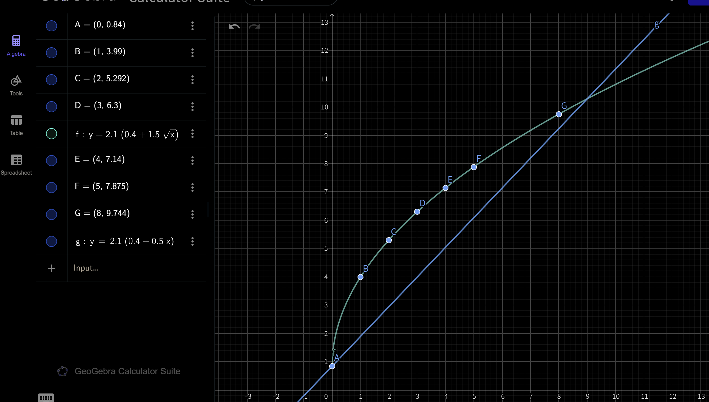

对于这种机制, 原来基于 $8$ 塔架构的 $462$ 工厂在当前版本得到的略微加强 (图上点G), 所以现在的单元产量应当是487.

采矿带产能插件是没道理的, 因为存在增加产能的科技, 所以同样是+30%的产能, 在科技达到+100%的时候, 插产能插件相当于只增加了15%的产能, 所以不太有道理, 但是采矿带塔更是没道理的, 因为塔占地3*3, 而矿机覆盖面积只超出矿机位置1格宽度, 所以塔下方至少有一个格子的矿直接浪费掉. 所以考虑在机器上插速度或节能, 效率是2.5:1, 能耗是5:1, 提升了一倍的能量效率(但是讲道理不至于, 因为矿采出来是要烧的, 而烧矿才是能耗大户, 所以可以考虑用稍高的能耗换更少的机器, 更简单轻松)

对于其他机器, 能上产能则上产能 (理论上是越下游产能越强, 但是产能实在是强)
即使是最上游的冶炼, 产能也很强, 因为考虑插两个产能后, 产能是120%, 8塔速度是0.7+3sqrt2 = 4.94, 产能*速度=5.93
如果插速度, 那么速度=2+3sqrt2=6.242
也就是说达到同样的产量, 产能和速度的炉子数量比是这两个值的反比: 6.24:5.93
但是产能炉子需要的原料更少, 也就是说他们的上游产线(除了炼钢, 其实只有采矿)的规模之比可以达到1:1.2, 这个差距显然更大.
产能如此强是因为塔上不能加产能, 而速度在8塔加持下是不缺的, 产能在一个独立乘区, 所以产能仍然是炉子的首选插件 

https://factoriolab.github.io/2.0/list?z=eJw1jz0LwjAQhv.NDS8oFxF0uaWxVlPTDoqCYyFCh1CMIE757ZImXe553vsgZBJ9wna.A2DBYJpEn1MjiVmkXeSyiF2km8UJzqloGmRPgzANopiCVG-YhACDlPW1vBNE32CR7Q6blqYce0BRkDpDvwpd4aUcfXI-HDOrtvCZWVCVs1XZPmWuMx4JXiyYvNRQc2rm2oGxIS9mnvVgGt1PDi15H6SOTTTRxi725AeX.utHUcz0FaX-giJVfQ__&v=11

这是一个487模块的计算器, 也算是原版的后期配置了.

# 插件厂相关

## 绿板厂

铜铁做原料, 瓶颈是铜, 一条蓝带的铜配 8 个机器, 产两条红带.

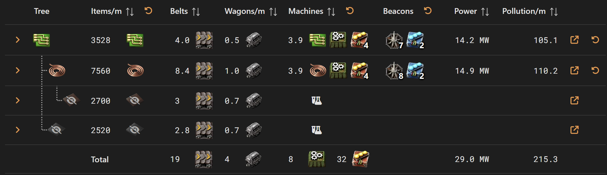

这里用七塔只是展示容错, 绿板做得比铜线略快 (要是有1.5的产能就正好了), 但是一般八塔, 绿板仍然比铜线略快.

\BluePrint\Green3528.txt

两个 487 模块需要 29399.2 绿板/min, 也就是 8.33 个 Green3528.

一共需要 20,999.42857 的铁, 也就是 7.78 带, 分成 9 带输入. 直接用一个 8 分 10, 然后 9 带进绿板厂, 剩下一带并入铁总线. 需要 22499.39 的铜, 8.33 带, 用 9 分十, 剩下 0.67 带.

对于输出, 因为一共是 18 条红带输出, 且没有满带, 所以直接合并成 12 条蓝带, 每条 2,646. 

蓝板+红板共需要 25,326.283 绿板, 9.57 个输出带. 剩余生产线需要 4074.2 绿板, 1.54 个输出带. 我们一共有 12 条绿板输出, 所以留两条上车, 剩下的 10 条给蓝板, q红板.

## 红板厂

因为已经失去了一对一的条件, 所以铜线只能走带子, 所以变成了瓶颈.

这里选择满红带铜线而不是满蓝带, 是因为铜线满红带后, 电路板和塑料恰好各是半红带.

如果后面蓝板厂集成了硫酸厂有甲烷供应, 那么可以选择就地产塑料, 否则直接运来.

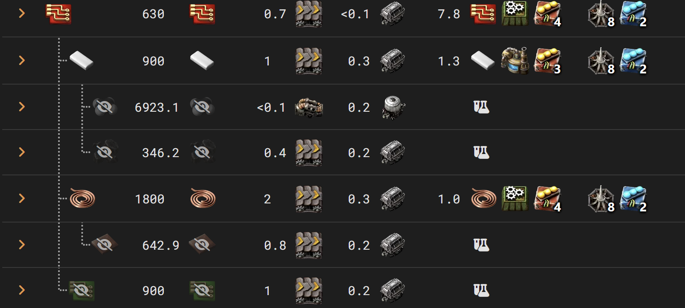

由于只需要7.8个机器, 所以可以酌情减少两端机器的塔数. (没有计算过, 不知道具体减少多少)

\BluePrint\Red630.txt

两个 487 模块需要 5158.4 红板/min, 也就是 8.19个 Red630.

需要 5,263.67347 铜, 1.95 带, 用绿板那里剩下的 0.67 带和两带铜用三分三摇出 1.95 + 0.72. 铜需要变成 14,738.2857 铜线再输入. 发现只需要 7.6 个八塔机器, 但是显然是压缩不到一排的, io 受不了, 所以选择更少的塔数, 比如四塔, 10.4 个. 一个 3 塔相当于 0.89 个四塔, 所以用两个 3 塔, 9 个四塔来生产这部分铜线. 但是每台机器的产量已经超过了半蓝带, 所以如果使用下图这种构型就只能生产 14,670 铜线. (其中两端是三塔)

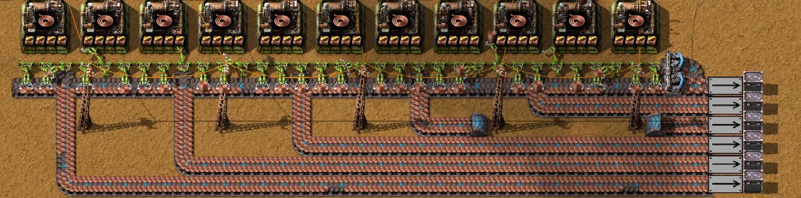

所以选择吞吐量更大的构型, 一共需要 5.4586 蓝带, 所以我们可以用堆栈式的输出, 将一条带填满后再用下一条带. 在每次填满一条带之后加一条. 四塔 (1428) 加三塔 (1260) 的产量是 2688, 不到一带, 所以在第三个机器 (前三台1带+1416) 的位置增加第二条输出 (1带+1416), 第四个机器(前四台2带+144)增加第三条输出, 第六个机器增加第四条输出 (3带+300), 八机器4带+456, 十机器5带+612, 十一机器5带+1872.


事实上由于只支持最多两条蓝带输入, 所以最后一台机器是跑不满的, 最多产 15120 蓝带 (5带+1620). 这也超过了需求, 后面经过六分六然后三个二分三输入红板厂即可.

需要 7,369.143 绿板和塑料, 分九红带, 半带绿板半带塑料. 每个单元最多 900 的绿板, 利用冗余, 3 个蓝带过来即可.

## 蓝板厂

原料数量中, 绿板断崖式领先, 所以如何塞绿板成了问题, 基本单元是 900 绿板对 63 蓝板, 能塞进去多少绿板就看造化了.

简单塞了 5400 绿板进去, 长度和前面两个厂差不多, 仍然是7.8个机器, 所以可以减少塔数.

\BluePrint\Blue378.txt

两个 487 模块需要 1257 蓝板/min, 需要 3.32 个 Blue378.

需要 17,957.14 绿板, 是 6.79 个绿板输出带 (2646/min), 我们直接把第四个单元砍半, 然后拉 7 条绿板输入.

需要 1,795.7143 红板, 2.85 个 Red630, 直接利用冗余拿 3 个输出带. 分成 4 条输入.

## 插件厂

插件不能加产能, 一级二级三级的产量需求是 16:4:1, 机器数量需求是 4:2:1.

对于1-2-4分别产三二一级插件的厂, 绿机器插四个速度, 八塔的架构, 分钟产量是略大于 9 个三级插件, 几乎可以当作是 9 个, 所需蓝, 红, 绿板分别是 225, 945, 720.

# 核电

一个反应堆40MW, 2*2的初级4核核电站毗连加成都是200%所以每个功率是120MW, 一共480MW
一个换热器功率10MW, 一个汽轮机功率5.8MW, 480MW需要48个换热器和82.758个汽轮机
如果考虑扩展, 则除了端点的四个核, 剩下的核都是160MW功率, 反应堆的宽度是5格, 如果使用如图对置换热器架构, 则宽度是6格(其中管道是相邻的组共用, 省掉一格)

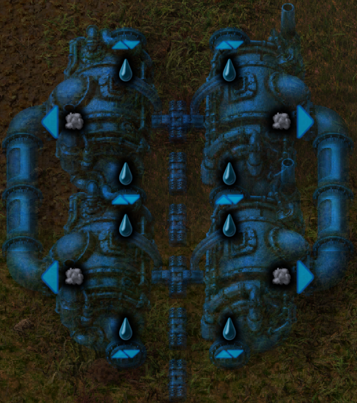

我们需要在每侧每格宽度处理 $160MW/5$ 的功率也就是 $32MW$, 也就是说七格宽度处理192MW, 也就是19.2个换热器, 10个换热器的长度是30, 所以我们至少给换热器留30格
值得一提的是, 为了减少液体系统的规模, 我们可以考虑通过管道泵分割液体系统, 同时需要注意一个管道泵的速度是1200/s, 也就是说它只能为20个汽轮机供应蒸汽或者为11.65个换热器运出蒸汽, 所以对于公用的管道(处理19.2个换热器的输出), 需要两个管道泵

汽轮机的尺寸是 $5*3$, 宽度是 $3$, 需要处理的功率是 $3*32=96MW$, 每个功率 $5.8MW$, 需要 $16.55$ 个汽轮机, 但是考虑到插电的问题, 我们需要在合适的地方不密铺, 所以考虑图中这种架构, 使得平均每个汽轮机占用5.5的长度, 也就是 $5.5*16.55=91$ 格.

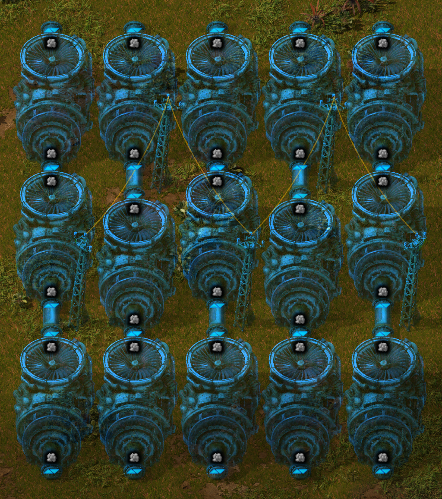

## 流体系统的分割

新版的整个流体系统可以视为一个整体, 只对大小进行了限制, 而内部的流动可以认为是瞬时不限流量的, 可以用管道泵进行分割, 但是管道泵存在流量瓶颈, 可以使用多个管道泵并联来解决这个问题.


每个共享管道, 每列汽轮机, 中间横向蒸汽总线, 分别是对应的流体系统, 但是我们或许也可以认为共享管道的独立是多此一举的, 因为它的长度非常有限(30)

## 铀工业

可以看到, 在只有一种核工业产物: 铀燃料棒的情况下, 238的消耗大部分是用来做燃料棒, 这时候铀浓缩和铀增殖的离心机比例为: 5.106:1.

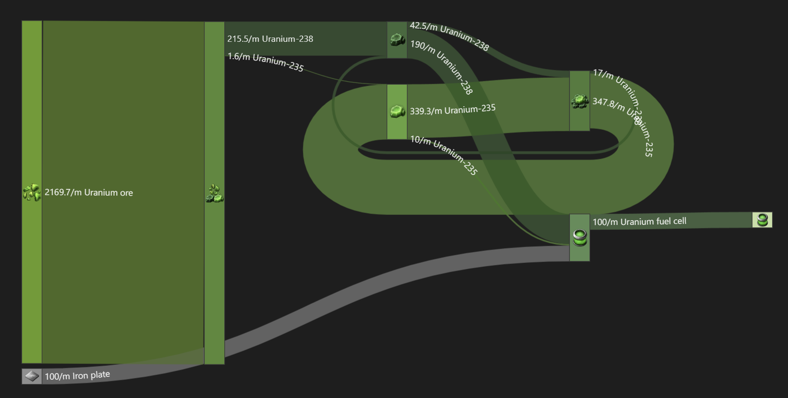

# 冶炼

## 大前期

48 个石炉烧铁满黄带, 24 个钢炉烧铁满黄带.

半黄带矿半黄带煤, 采用两排炉子包夹成品带子, 各自使用两侧各自的矿带. (24 + 24 结构和 12 + 12 结构)

烧砖思路类似, 大同小异.

炼钢和炼铁的速度恰好相同, 所以一般炼钢的炉子由一个炼铁的炉子直接供应铁, 一一对应, 减少了传送带的使用. 但是这种结构最好和中号电线杆结合使用.

## 无插件电炉

减少了燃料的走线, 矿可以满带进入了, 速度和钢炉一致.

对于铁铜, 24 个炉子一排, 满黄带产量, 两排一组. 外侧走矿内侧走板. 由于输出时爪子会把产物放在远端, 所以在 12 号炉子后面可以将两条成品带互换, 这样就可以把原来的远端变成近端, 实现双满带输出. (其实也可以在 12 号炉子后面将输出爪子改成长爪, 这样就可以把板放到对向的远端, 同样可以保持两侧满带)

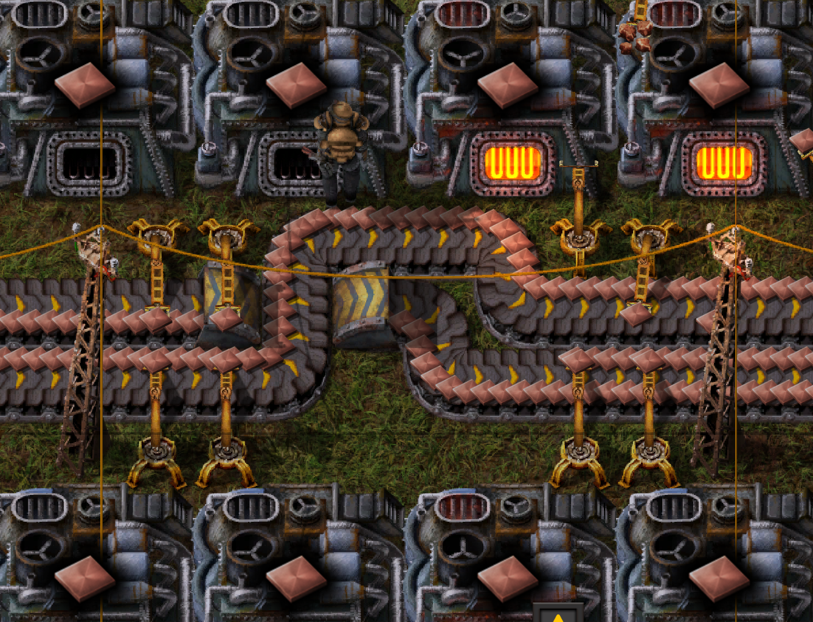

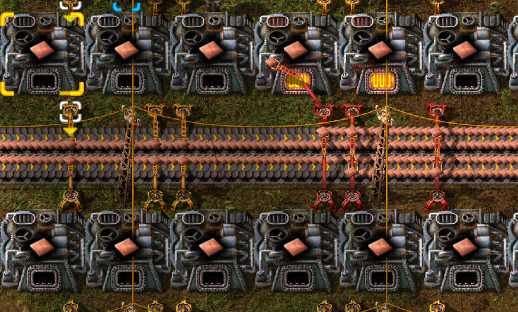

烧砖的产线矿:砖是2:1, 所以中间的传送带可以变成只有一条. (但是貌似可以跳过这个阶段, 后期直接上插件冶炼厂了)

对于炼钢, 我发明了一种藏带的 $48 * 4$ 结构, 四排并行的炉子处理 $3600$ 铁矿每分钟输出 $720$ 钢每分钟. 中间两排炼钢, 外面两排炼铁. 对于炼铁和炼钢中间, 隔两格的空隙, 每格都用地下黄带运铁矿, 错开 3 格. 在靠近铁炉的那一格位置, 每个铁炉两个爪子, 供应铁矿和转移铁板. 由于只使用了靠钢炉一侧地下黄带的铁矿, 在 24 号炉子, 这一路铁矿就耗尽了. 这时将一直藏着的另一条转到靠钢炉一侧, 开始消耗新的一路铁矿, 供应 25-48 号炉子.

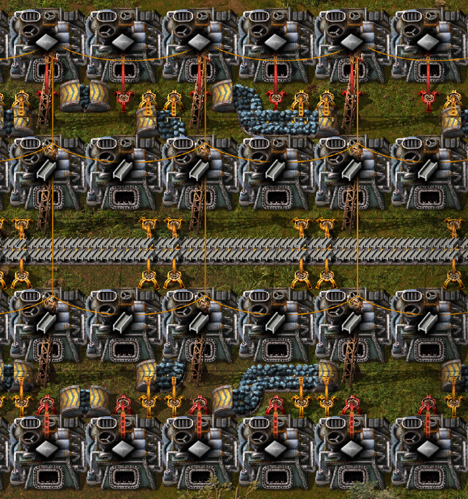

## 带插件普通冶炼

首先是一个机制, 爪子往带子上放东西的时候, 如果带子和爪子垂直, 这个很简单, 爪子放到远端. 如果带子和爪子平行, 那么爪子会放到带子的右侧. (题外话: 这个游戏的方向有很强的相对性, 从汽车/坦克/火车的驾驶就能初见端倪, 讲究的是运动物体的左右, 而不是绝对的左右, 也就是东西南北这种, 所以这里说的传送带右侧, 均分器的右路, 都是说以传送带运行方向为前方, 然后再定左右) 如果带子是弯的, 那么爪子会放在内环. 爪子和带子的机制会频繁用于这部分.

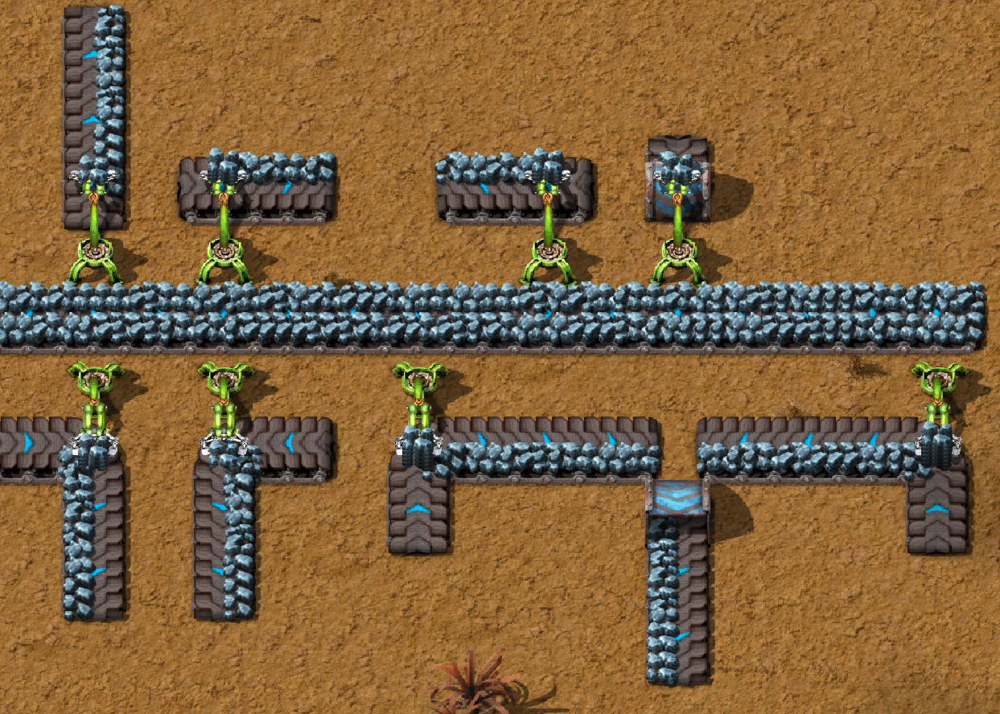

市面上最流行的是宽度为 5 的 8 塔 2 产能架构, 每个单元产量 5400, 24.3 机器. 机器交错排列于五格宽度内, 每个机器旁边有 $3*2$ 的空间, 6 个格子的面积可以放两个爪子用来上下料, 剩下四格用来走线. 输出带和一侧的机器出料爪平行, 和另一侧的出料爪垂直, 这样可以做到两侧的机器分别输出到左带和右带. 单侧可以走两条线, 但是一共不能走四条, 因为需要有插电的空间, 所以一共最多走三条线. 有一种奇技淫巧, 因为每个截面只能走三条带, 但是 5400 产量的矿和板都需要两个蓝带. 考虑到矿和板在同一截面只会有一个大于一条带, 所以在前半部分两条带走矿一条带走板, 后半部分一条带走矿, 两条带走板.

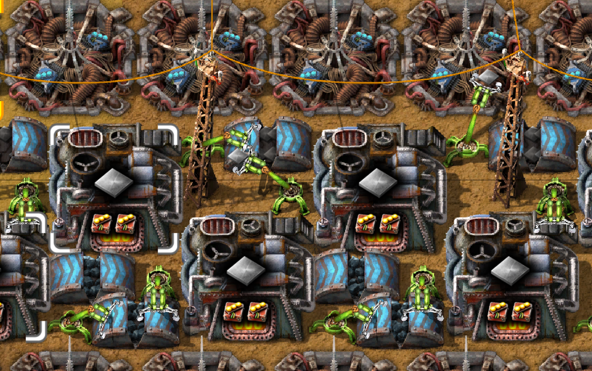

这种设计需要两部分之间留出空间走线, 我试过 0 格, 1 格, 2 格空间都没有很好的解决方案, 更何况还要末端平衡 (下面会说), 所以我最后拼尽全力凹出了三格:

一个 5400 单元由前后两个 2700 单元组成, 中间留出三格走线. 每半单元有 13 台电炉, 前半单元有 10 台八塔, 3 台 6 塔, 6 塔相当于 0.884 台 8 塔, 这是可以满足 12.2 个八塔的需求的. 后半单元有 11 台八塔, 2 台 6 塔, 整个单元单侧一共是 27 个塔, 不知道能不能再凹.

但是, 半带的不均衡也是会造成阻塞的. 两种说法: 一个半蓝带要接受 6.08 个八塔炉子的输出; 第 13 个炉子必须向带子的两侧都输出. 这个我不知道业界叫什么啊, 暂且称其为: 末端平衡.

我的处理方式也是扭了半天才扭出来的, 这是单元中间走线区的末端平衡.

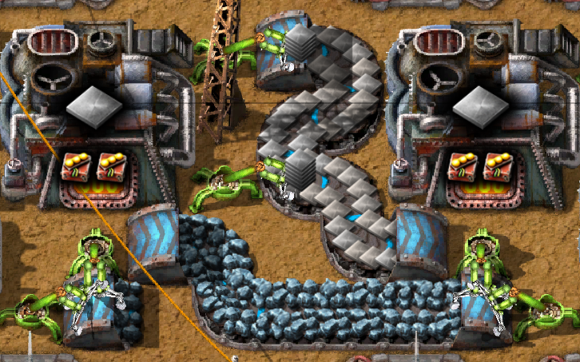

然后是最后的末端平衡:

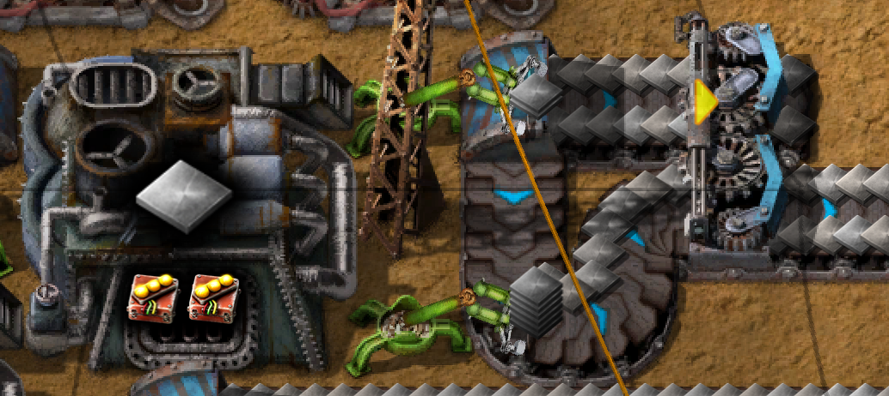

除了炼钢需求外, 两个 487 模块需要 31,802 铁, 和 51,192 铜. 其中 2/3 的铁和铜用来做绿板和红板, 所以在冶炼厂附近直接造电路板防止远距离运输.

5400 冶炼单元需要分 6 个给铁, 10 个给铜.

## 带插件矿-钢

由于每个电炉带两个产能, 烧铁:烧钢从 1:1 变成 5:6, 所以两排炉子并行不再适合 (而且并行也没法在八s塔的情况下爪子直连两个熔炉).

如果采用原先的 5 宽度架构, 那么最多走三条线, 我们能想到的一个解决方案是直接在前面的 5400 的炼铁模块后面加 30 个熔炉炼钢.

后面的三十个熔炉仍然是分成前后两个部分, 中间只需一格走线, 凹一下塔数就是六台机器六塔, 24 台机器八塔, 相当于 29.304 个八塔, 需要的是 29.2 台八塔, 已经几乎没有余量了.

这样就组成了一个 Steel1296 模块: 

BluePrint\Steel1296.txt

两个 487 模块需要 9,332.6 的钢, 也就是 7.2 个 Steel1296 模块.

但是如果考虑使用别的宽度是否能凹出更牛逼的单模块产量呢? 让我试试先.

6 宽度没凹出来, 熔炉有靠近塔的一侧和远离塔的一侧, 靠近的一侧只有一格宽, 是垃圾宽度, 除了走对侧能用到的线没有用.

7 宽度不用交错了, 简单试了一下貌似可以藏 4 条蓝带, 也就是 10080 的铁矿输入, 换来 3110.4 的钢产量, 一共需要 70 个八塔炼钢和 58.3 个八塔炼铁, 把战线拉得巨大长. 所以使用价值不大. 大概的样子是这样的:

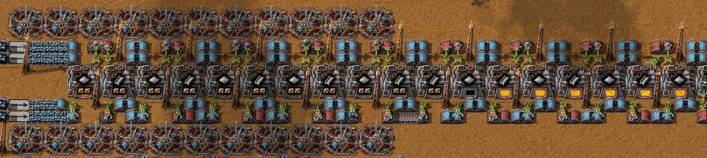

# 化工

## 无插件甲烷厂

原油+水->甲烷(无其他产物)

40 重油 = 30 轻油
30 轻油 = 20 甲烷
40 重油 = 20 甲烷

每个白板炼油厂产量: 300 重 540 轻 660 气 (每分钟)
每个白板重油裂解: 1200 重油 (每分钟)

炼油:重油裂解 = 4:1

每个炼油厂轻油 (直接产物+重油裂解) = 540 + 300 / 4 * 3 = 765轻油 (每分钟)
每个白板轻油裂解: 900 轻油 (每分钟)
炼油:轻油裂解 = 900:765 = 20:17

白板机器最简无损比例, 炼油:重油裂解:轻油裂解 = 20:5:17

这个单元的甲烷产量是 23400 每分钟, 下面是计算器页面.

https://factoriolab.github.io/2.0/list?z=eJzLt3Vx1zIyNjEwUEu11XIGEZ5qSbYWakW2TmFaviAqFEKFgClnVzDlEqmlZQASLdLSMoSwCmEslwiInHuklpYhiI6CyTh7afmAlCZBTEyEUFEQg120fNUyUytsnXLrnPLUcnOLbF3rvOq81cpsDQ0Bw58sBg__&v=11

## 有插件甲烷厂

对于上插件的情况, 化工厂用 8 塔, 炼油厂考虑 10 塔和 5 塔两种选择, 最后讨论.

首先还是计算重油-轻油-甲烷转换比. 化工厂是三个槽提供 0.3 的产能, 所以:

40 重油 = 39 轻油
30 轻油 = 26 甲烷
400 重油 = 390 轻油 = 338 甲烷 

化工厂的速度是 $1 - 3 * 0.15 + 1.5 \sqrt{8} = 0.55 + 3 \sqrt 2 = 4.79264$

重油裂解每厂消耗 $4.79264 * 1200 = 5751.168$ 重油每分钟, 产轻油 $4.79264 * 1170 = 5607.3888$ 每分钟.

轻油裂解每厂消耗 $4.79264 * 900 = 4313.376$ 轻油每分钟, 产甲烷 $4.79264 * 780 = 3738.2592$.

炼油厂输出的轻重油比例 $5:9$, 最后需要裂解的轻油是 $9 + 5 / 40 * 39 = 13.875$.

所以重油裂解:轻油裂解 = $\frac{5}{1200} : \frac{13.875}{900} = \frac{5}{4} : \frac{13.875}{3} = 10:37$.

10重油厂+37轻油厂的输入需求: 57511.68 重油 + 159,594.912 轻油 (每分钟)

最后是考虑炼油厂的两种架构, 但是由于速度常数的区别 (无理数), 两种架构的炼油厂数量和化工厂数量都不能做到整数比. (如果非要做到整数比, 只能选择8塔炼油厂, 保留一下这个idea)

炼油厂的速度常数 $v = 1 - 3 * 0.15 + 1.5 \sqrt{k} = 0.55 + 1.5 \sqrt k$ (k 塔)

单厂产出 $390v$ 重 $702v$ 轻 $858v$ 气 每分钟.

设 $x$ 个炼油厂可以供应一个 10+37 单元的需求, 那么 $390xv = 57511.68$, $x = \frac{57511.68}{390v} = \frac{147.465846}v$.


|k|v|x|
|-|-|-|
|5|3.9041|37.772|
|8|4.79264|30.77|
|10|5.2934|27.86|

理论上 $k = 2/8$ 的时候是有整数比的 (根号二可以约掉), 但是我懒得算了.

最后是一个 `10重37轻` 单元的甲烷产量: $126,525.696 + 138,315.5904 = 264,841.2864$.

## 塑料厂

1 煤 = 2 塑料, 1.3 产能加成 1 煤 2.6 塑料.

两个 487 单元需要 12,686.2 塑料每分钟. (4879.31/min 煤)

是 16.98 个八塔三产能化工厂, 或者是 18.00 个七塔三产能化工厂, 19.28 个六塔三产能化工厂. 每个六塔三产能化工厂相当于 0.881 个八塔三产能化工厂.

打算使用 18 个三产能化工厂, 6 个一组, 四个八塔, 两个六塔, 相当于 $5.762$ 个八塔三产能化工厂, 需求是 $5.66$ 个八塔三产能化工厂, 可行, 设计产量 $12917.1/min$ 塑料, 消耗 $4968.2/min$ 煤.

以 3 红带输入煤.

4680 塑料每分钟的厂需要 1800 煤每分钟.

# 其他产线

## 轻质框架

瓶颈是铜, 塞进去两条蓝带, 是 378 产量. 需要 11.64 个八塔四产能, 选择 10 个八塔 2 个六塔, 一共是 11.75 八塔.

半蓝带的塑料输入, 540的钢输入(放在塑料另一侧), 两满蓝带的铜输入, 输出是 378 轻质框架每分钟.

发现蓝板和轻质框架都是 378 单元, 原因是瓶颈原料:产物都是 20:1, 并且都塞了两蓝带的瓶颈原料进去.

两个 487 模块需要 1,489 个轻质框架, 3.939 个 378 模块, 刚好放四个. 铜直接从冶炼拉八条带, 塑料从卸货站拉两条分成四个半带, 钢拉一个蓝带过来分.

# 铁路

## 有关列车制式

网络上流行的列车制式是二拖四, 我们来分析一下列车速度和制式的关系, 来体会一下为什么是二拖四.

下面截取一段官方 wiki 的记录:

> The maximum speed that a locomotive can get to depends on the train that it is pulling. The speed of an accelerating, fully fueled, train is calculated every tick by the game with the following formula:

```
train_speed = max(0, abs(train_speed) - train_friction_force ÷ train_weight)
train_speed = train_speed + (10 × number_of_locomotives_in_moving_direction × fuel_acceleration_bonus ÷ train_weight)
train_speed = train_speed × (1 - air_resistance_of_front_rolling_stock ÷ (train_weight ÷ 1000))
```

> where train_friction_force is the total friction of each wagon and locomotive (0.5 for any type of wagon including locomotives) and train_weight is the total weight of each wagon and locomotive (see their individual pages for the weight values). The friction and air resistance of wagons and locomotives can be found in their prototypes. The calculated train_speed is capped to max_speed = 1.2 * fuel_top_speed_multiplier.

不同的燃料提供加速度加成不同, `fuel_acceleration_bonus` 值分别是, 木头 $1$, 煤 $1$, 固体燃料 $1.2$, 火箭燃料 $1.8$, 核燃料 $2.5$. 极速加成 `fuel_top_speed_multiplier` 也不同, 木头 $1$, 煤 $1$, 固体燃料 $1.05$, 火箭燃料 $1.15$, 核燃料 $1.15$.

列车重量 `train_weight` 是每一节的总和, 在 wiki 上的数据是机车 $2000$, 货车 $1000$, 重炮 $4000$.

代码第一行计算摩擦阻力. 摩擦阻力 `train_friction_force` 每个车厢 0.5 (包括机车).

第二行计算牵引力. 发现只有正面朝向前进方向的机车提供牵引力, 每个机车的牵引力是 10 * `fuel_acceleration_bonus`.

第三行计算空气阻力, 这里的阻力公式可以变形:

```
train_speed = train_speed × (1 - air_resistance_of_front_rolling_stock ÷ (train_weight ÷ 1000))
train_speed -= train_speed * 1000 * air_resistance_of_front_rolling_stock ÷ (train_weight)
```

也就是阻力是 $1000$ 倍的阻力常数乘以速度.

实体的空气阻力常数 wiki 上没找到, 解包文件 `Factorio\data\base\prototypes\entity\trains.lua` 后找到了一些数据:

火车头的空气阻力是:

```
air_resistance = 0.0075, -- this is a percentage of current speed that will be subtracted
```

这里所谓 `air_resistance_of_front_rolling_stock` 大概率是说这里只计算最前面的车厢的空气阻力, 而这个车厢一般是火车头, 也就是阻力为 $7.5v$.

如果是别的车厢, 空气阻力常数也列出一下, 货车是 $0.01$, 重炮是 $0.015$.

最后还会控制车速不超过极速. 没有燃料加成时, 极速 `max_speed` 是 1.2 单位每 tick. 

可以看出火车头的数量在运行层面只影响加速度, 更重的列车需要更多火车头.

车厢的数量一般选择 $2$ 的整数次幂, 方便上下货的均分. 但是 $2$ 节车厢太小(车的长度还没有匝道长), $4$ 节 $8$ 节都是比较合理的车厢数量.

我是不想做双向列车的, 这种车一般只用于前期的独立铁路, 而前期我并不习惯用列车.

我才发现有这个工具可以计算列车的加速和极速: https://calculatorio.com/train_acceleration/

当一拖四时, 使用核燃料, 极速 $298km/h$, 加速到极速需要 $8.25s$, 使用固态燃料需要 $73.53s$ 加速到极速 $272.16km/h$.

二拖四时, 核燃料的加速时间变成 $4.45s$, 固态燃料则是 $10.67s$.

当我们继续增加机车数量, 核燃料的加速会收敛到 $1.9s$, 而固态燃料会收敛到 $3.68s$.

所以对于四车厢, 可以选择核燃料的一拖四或者任何燃料的二拖四. 核燃料二拖四性价比不高, 普通燃料的一拖四性能过低.

对于八车厢, 有如下表:

|机车数量|核燃料加速时间|固态燃料加速时间|
|-|-|-|
|1|669.05|15.65|
|2|18.38|7|
|3|11.57|5.05|
|4|9.08|4.17|
|5|7.80|3.68|

核燃料二拖八是一个比较精简的选择, 如果不考虑核燃料, 那么固态燃料四拖八可能会是一个甜蜜点.

考虑到厂区大小和千瓶目标, 我觉得固态燃料二拖四会是一个不错的选择, 到了后期可以考虑升级成核燃料而不需要改车站. (其实对于原矿这种产量巨大的运输需求, 可以使用更高制式的列车, 但是这样会使得体系更复杂, 所以暂时不用)

## 下货站 (Drop)

首先可以推出一个下货速率的上界: 因为绿爪是需要回头的, 所以单侧蓝带需要大于一个绿爪. 一共是 6 个绿爪, 所以小于 3 带. 

所以我们希望以单侧两带为目标, 也就是三个爪子放一带.

一个比较显然的结论是, 两个爪子的抓取合成一条带的两侧, 然后第三个爪子的抓取合成另一条带的两侧, 最后把这两条左右平衡的带子合并起来.

市面上大部分的下货站都用到了均分器来接收爪子的物品, 测试的时候, 我发现在缓存相同的时候, 放到均分器上的爪子比放到带子上的爪子更早搬空, 但是肉眼观察流量发现没有什么区别, 所以我就拉出来做了个实验, 截图盯帧, 发现两次放物品之间的空隙, 下面的爪子空了六个传送带节, 上面的爪子空了五个. 大约是因为两者的判定点不同, 所以爪子转动的角度也不同. 差之毫厘, 谬以千里.

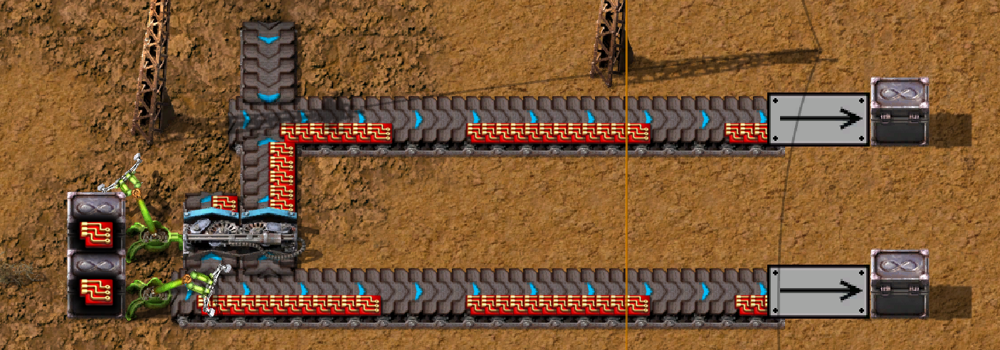

而且根据这个数据, 满级科技的爪子每次抓 12 个物品, 哪怕是直接抓到传送带上, 空 6 个物品, 理论上的运力也应当是 $\frac 23$ 个半带. 所以三个爪子就是一带. 这完美符合了我们对下货站的运力期望.

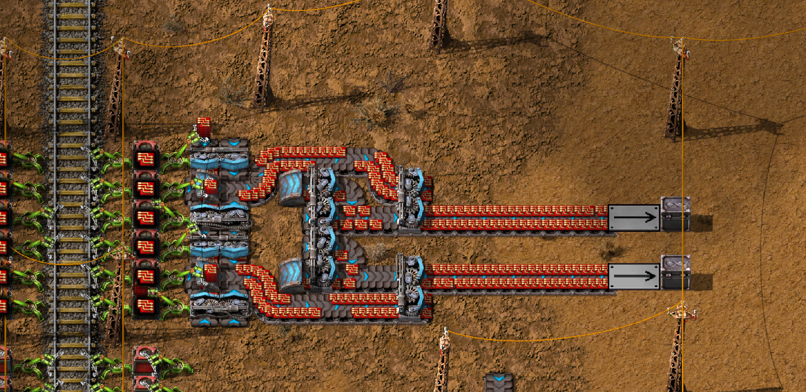

但是继续盯帧会发现, 输出带仍然存在缺位. 发现一个货物会挡住两个传送带节, 所以前面提到的两次放在均分器上的货物中间露出了 5 个链节, 事实上是间隔了 6 个位置. 所以中间的那个爪子直接放在传送带上, 露出 6 个链节其实是间隔了 7 个位置.

所以我们的运量事实上是 $\frac 12 (\frac {12}{18} + \frac {12}{18} + \frac {12}{19}) = \frac 23 + \frac {6}{19} = \frac{56}{57}$ 带.

我目前还没有找到更快的方法.

现在需要 8(钢) + 6(铁) 个铁矿模块, 28 带上料, 实际上只需要 28 / 1.2 带的铁矿, 一共是 23.333 带. 一个下货站可以下 $16 * 56/57$ 带, 所以至少需要两个下货站下铁矿. 平均每个下货站只需下 12 条不到, 所以可以不必压榨到 16 带每站.

12 带 48 爪, 所以两个爪抓半带就可以. 然后用六分七摇出来. 而且在冶炼 120% 产能下, 6/7 带输入是可以支持满带输出的.

铜是 20 带上料, 也需要两个站, 但是每个站只需 10 带, 还是用 12 带下货站, 用六分五摇出来即可.

## 上货站 (Load)

虽说下货是有三带上界的, 但是上货不一定, 因为上货的时候爪子是可以从两侧抓取的, 因此上货在某种意义上更加简单.

先是尝试了三带上货, 发现吃不满, 所以也采取了更加通畅的两带.

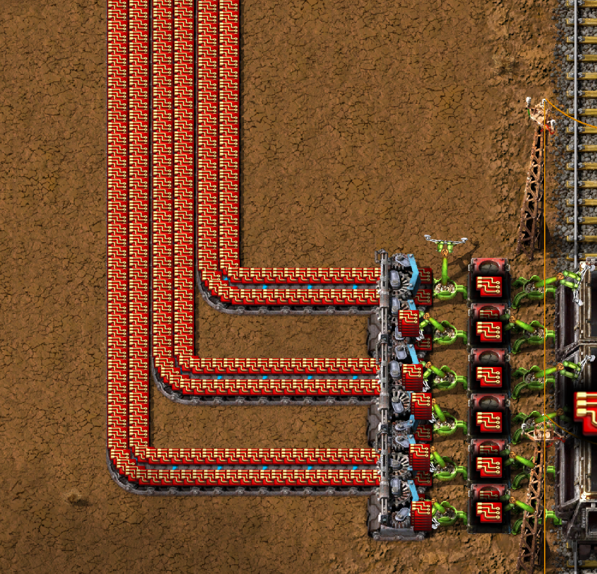

因为爪子可以从带子的两侧抓取, 只需满足在全速运行时, 每个爪子可可以抓取 1/3 带的产品, 也就是进行一个 1-3 的均分. 输入 1, 经过两层均分器变成四个 1/4. 这时候把其中一个 1/4 作为第一层的输入, 形成一个环, 这时候可以列方程解一下这个递归结构的量.

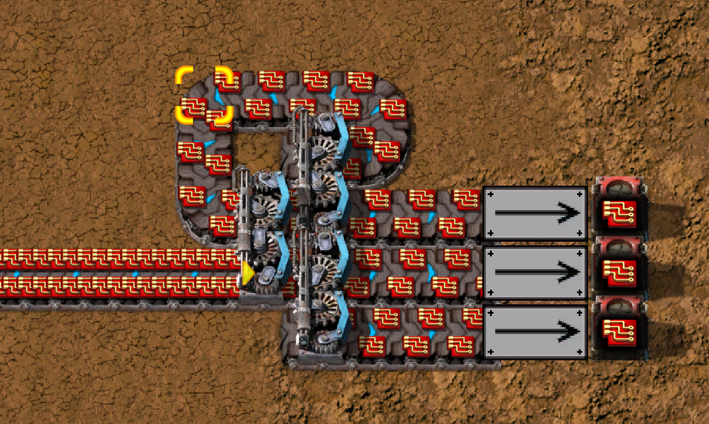

设环上流量为 $x$, 输入为 $1$ 带, 第一层的两个输出就是 $\frac{1 + x}{2}$, 第二层的四个输出就是 $\frac{1 + x}{4}$. 我们有线性递推方程:

$$
x_{i + 1} = \frac{1 + x_i}4\\
x_0 = \frac 14
$$

解得:

$$
x_i = \frac{1}{3} - \frac 1{12}(\frac 14)^i\\
\lim_{n\to \infty}x_n = \frac{1}{3}
$$

其中 $x_i$ 是环一共转了大于等于 $i$ 圈, 小于 $i + 1$ 圈的时候, 环首的流量.

所以这个结构会收敛到 1 分 3 均分器.

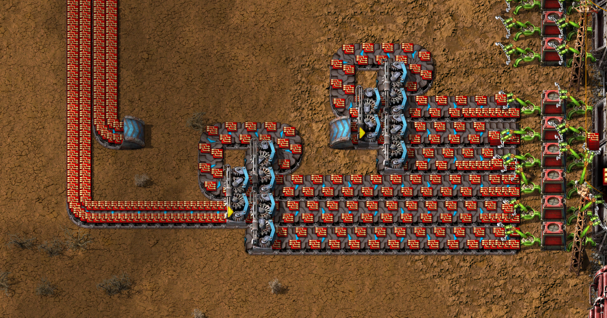

但是这种上货站有点过于臃肿了, 所以连忙去进修. 发现不需要特别严格的均分, 所以只需大致均分.

# ideas

## 棋盘格

(曾经独立发明并命名为 "曼哈顿结构", 结果发上 B 站遭群嘲)

用铁路网将产线划分为网格, 每个网格有车站进行上下货, 作为生产模块, 可以无限扩展, 且无需严格量化, 只需水多加面面多加水. 

缺点: 需要大量的车站和铁路, 且规模大到一定程度会造成拥堵.

## 环状总线

灵感来自于戴森球计划的整条纬线作为总线的想法, 还有就是当代中国大城市的路网和城市格局.

大体思路是: 根据产品的层级 (初级/高级) 来划分内外环, 从中心开始设计产线, 内层的产品需求量更小, 而外层的产品更为初级, 需求量更大.

特点: 难以扩展, 半黑盒, 贴近现实, 符合直觉.

## 火车帝国

之前看压榨 tps 的技巧, 说是物品在传送带上会非常消耗性能, 所以需要尽可能从机器到机器, 从箱子到机器, 从机器到车厢这种方式进行运输.

无传送带的极致便是直接从机器抓进火车车厢.