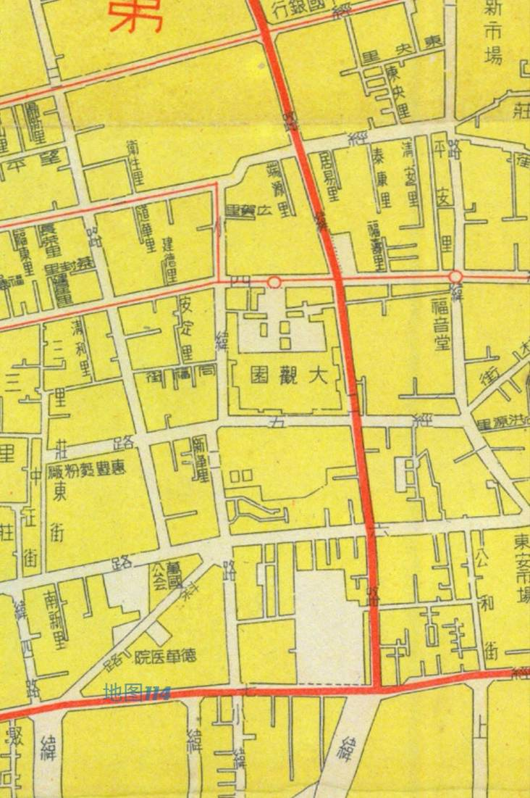

# 济南主要快速路研究

## 快速路

### 北

二环北几乎和$\text G35$济广高速重合, 所以没有高架化, 也不是快速路. 济南的北部快速路是由北园高架和工业北高架组成的, 是两条横向大动脉之一.

- 北园高架段
国际医学中心立交($\text G20_{01}$绕城高速)-(齐鲁大道)-匡山立交(二环西)-北园立交(顺河高架)-全福立交(二环东)

- 工业北段
全福立交-郭店立交/收费站($\text G20_{01}$绕城高速)-董家立交/收费站($\text G99_{11}$绕城二环)

其中, 工业北段的绕城高速东侧在建.

### 南

二环南高架

(二环西)-英雄山立交(顺河)-搬倒井互通(二环东)-港沟枢纽/收费站($\text G20_{01}$绕城高速/$\text G2$京沪高速)

### 中

顺河高架

济南北立交/收费站($\text G35$济广高速)-北园立交(北园高架)-玉函立交(经十路)-玉函路隧道-英雄山立交(二环南高架)-济南南互通/收费站($\text G20_{01}$绕城高速)-103省道

### 东

二环东高架

104国道-零点立交($\text G35$济广高速)-全福立交(北园/工业北高架)-燕山立交(经十路)-搬倒井互通(二环南)-兴隆枢纽/收费站($\text G20_{01}$绕城高速/$\text S7$济泰高速)

### 西

二环西高架

建邦黄河大桥-天桥立交/收费站($\text G35$济广高速/二环北)-匡山立交(北园高架)-腊山立交(经十路)-(二环南)-市中立交/收费站($\text G20_{01}$绕城高速)

### 经十路

经十路没有快速化, 但是由于绿波带影响, 在道路畅通的前提下, 仍然能达到快速路的通行效率.

当然, 经十路几乎没有畅通的时间, 不过北园高架也没有什么畅通时间就是了.

220国道-文昌立交-经十西路-济南西立交/收费站($\text G20_{01}$绕城高速)-经十路-腊山立交(二环西)-八一立交(纬二路)-玉函立交(顺河高架)-燕山立交(二环东)-邢村/济南东立交/收费站($\text G20_{01}$绕城高速)-经十东路-港西立交(唐冶中路/港西路)-孙村立交(春晖路)-309国道-孙村东收费站/圣井西立交($\text G99_{11}$绕城二环)-圣井立交(绣源西街)

220国道长清段存在并行路段, 东线是经十西路.

## 关于环路

- 济南没有官方一环路
有说法认为护城河是所谓 "一环", 也有人把 "一环" 定义为是北园高架, 经十路, 历山路, 纬二路.

- 二环高架路 $\neq$ 二环路
二环西路和二环东路和对应高架路重合. 北园高架路并非二环北高架, 二环北路大部分路段和 $\text G35$济广高速重合. 二环南高架路甚至有和二环东路共线的区段, 也和二环南路存在共线段, 但是二环南路在英雄山立交(二环南高架和顺和高架)以西北上, 在高架路北边两公里出头的距离继续向西, 直到终于二环西路, 二环南高架则是直接西行进入老虎洞山隧道和石房峪山隧道.

- 绕城高速内的高速
今天绕城高速内存在一段被标记为 "济广高速" 的高速, 经过查找资料发现其实是 1999 年通车的绕城高速北线.
根据 2005-01-18 的[政府文件](https://www.jiyang.gov.cn/art/2005/1/18/art_16649_919816.html), 济南现在的绕城高速北线当年被称为 "大北环", 在原济青高速北侧 11 公里左右. 在 "大北环" 之前, 西段是 1993 年西起于济南收费站零点立交的济青高速. 年代久远, 维基百科和大部分网络资料使用了 1999 年的通车时间, 却使用了 2005 年以后的线位, 在 2000 年的历史卫星图上, 如今北绕城仍无道路痕迹:

2005年5月时, 大北环出现施工痕迹, 2006 年线位已基本成型.

2024 年及以后, "大北环" 的资料都是代指济南都市圈环线北线了.

## 高速公路

- $\text G2$京沪高速
商河北互通($\text S14$高武高速)-郭家屯枢纽($\text G99_{11}$绕城二环)-济阳西枢纽($\text G25_{16}$东吕高速)-崔寨西互通($\text G20_{01}$绕城高速)-...-港沟枢纽-曹范立交($\text G99_{11}$绕城二环)-莱芜枢纽($\text G22$青兰高速/$\text S29$滨莱高速)-莱芜东枢纽($\text S26$莱泰高速)-钢城枢纽($\text G22$青兰高速)
崔寨西-港沟段和$\text G20_{01}$绕城高速共线.

- $\text G3$京台高速
齐河北立交($\text G20$青银高速)-晏城枢纽($\text S1$济聊高速)-...-殷家林枢纽($\text G35$济广高速)

> 中国高速公路万里纪念塔，位于山东省泰安市岱岳区卧虎山山顶上，是为纪念中国高速公路总里程达到1万公里而建于2001年。

- $\text G20$ 青银高速
和北绕城共线.

- $\text G35$ 济广高速

- $\text G25_{16}$东吕高速

- 济青高速
起点在零点立交, 所谓**零点**, 表示山东高速的第零公里里程碑.

### 关于绕城 

$\text G20_{01}$济南绕城高速

和多条高速共线, 

- $\text G3$京台高速: 殷家林枢纽-晏城枢纽
- $\text G35$济广高速: 殷家林枢纽-槐荫枢纽
- $\text G20$青银高速: 表白寺枢纽-机场枢纽

- $\text G99_{11}$($\text S01_{01}$)济南都市圈环线高速(绕城二环)
除张夏枢纽立交到曹范立交外, 已全部建成. 剩余部分穿越南部山区, 造价高达 3 亿每公里以上, 推进缓慢.

## 国道

-104国道
京岚线

## 关于经纬

济南的老商埠区域道路命名符合 "经 X 路", "纬 X 路" 的规则, 但是东西向的是经, 南北向的是纬. 原因众说纷纭, 有的说经纬的概念并非取自地理学的经纬线, 而是纺织业的经纬, 后者的经线是更长的, 纬线则是更短, 符合济南的规划特征; 有的说是当年军阀张宗昌认为不应该照搬西方人的说法, 所以故意反着命名. 我个人倾向于前一种说法. 坊间也有将 "经 X 路" 称作 "X 大马路", "纬 X 路" 称作 "X 马路" 的习惯.

接下来记录从经一路到经十一路, 纬一路到纬十二路的沿线地标, 两端延申. 顺序遵循自西向东, 自北向南的方向.

- 经一路
经二路(纬十二路)-明湖西路-明湖北路-明湖东路-(东关大街, 历山路)-花园路-花园东路

- 经二路
槐村街(经四路)-(纬十二路,经一路)-普利街(顺河高架,顺河东/西街)-共青团路

- 经四路

(经二路,槐村街)-共青团路(顺河高架,顺河东/西街)-泉城路-解放路-解放东路(二环东路)-(奥体中路)

- 经七路

机床二厂路-南辛庄街(经十路)-泺源大街(顺河高架,顺河东/西街, 民生大街)-和平路(历山路)-和平东路(二环东路)-姚家路(礼士路)

- 经十路

在前面的部分已经记录.

- 经十一路

(舜耕路)-(山师东路)

- 纬一路
小纬北路-(明湖西路)-马鞍山路(经十路)

- 纬二路
G104京岚线-泺北大道-济泺路黄河隧道-济泺路-天成路(天桥)-八一立交桥(经十路)-英雄山路(顺河高架) 

- 小纬二路
(经三路)-(经七路)
关于小纬二路和大纬二路的关系, 1947 年地图上就已经是如今的格局了.

- 纬六路
小鲁庄路(二环北路)-无影山北路-金牛桥-无影山路(师范路,小清河南路)-(北园高架)-纬六路高架桥-(经一路)-(经七路)

- 纬十二路
(二环西路)-济齐路-(黄冈路)-(堤口路,张庄路)-(经一路,经二路)-(经十路)-阳光新路-郎茂山路-九曲庄路(二环南路)-(二环南高架)